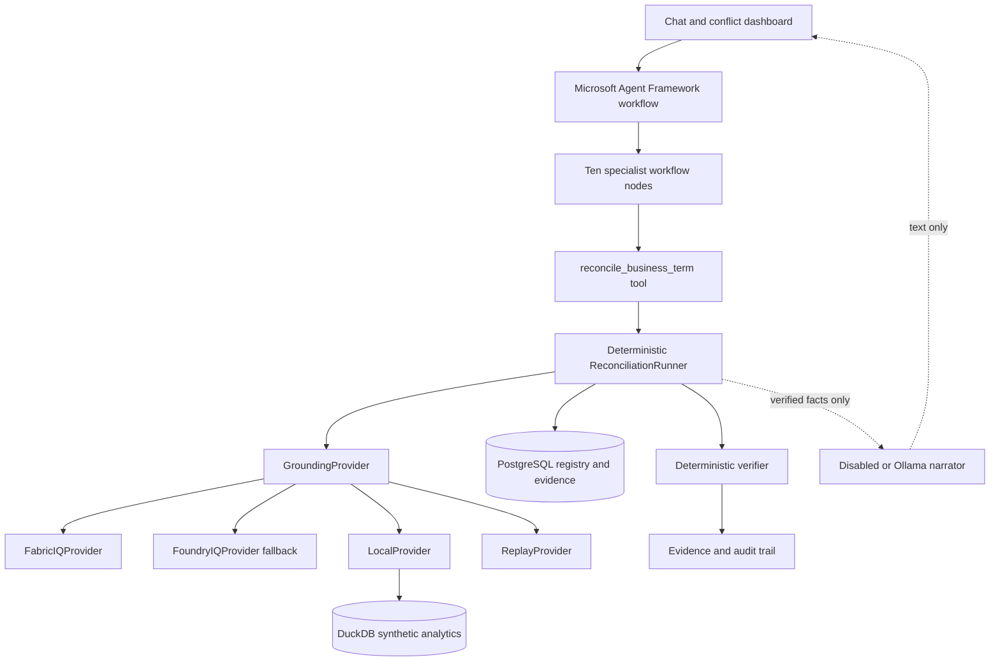

# Concord IQ

**The semantic reconciliation agent for enterprise meaning.**

[](#hackathon-alignment)
[](#hackathon-alignment)
[](#microsoft-iq-architecture)
[](https://www.python.org/)
[](#implementation-status)
[](#license)


> Enterprises built a single source of truth for data, but not for meaning.

Finance, Sales, and Customer Success can use the same business term while binding
it to different filters, time windows, populations, grains, and sources. Concord IQ
is designed to find those differences, execute each definition against data, rank
the material impact, and propose a governed semantic reconciliation. When authority
is shared or ambiguous, it refuses to choose and routes the decision to a human.

## Implementation status

Concord IQ uses Microsoft Agent Framework as the orchestration layer. Specialist
agents coordinate through a typed casefile and call deterministic reconciliation
tools. The workflow can be deployed through Foundry Agent Service. Fabric IQ is
the primary semantic grounding provider, with Foundry IQ as fallback and
LocalProvider for reproducible public review.

Guarded Foundry IQ and Fabric IQ adapters, typed capture/replay, Fabric bootstrap
helpers, optional local narration, and the Agent Framework integration are
implemented. This workspace had no configured Microsoft tenant, so the required
real IQ smoke capture remains open. No sanitized artifact or successful Microsoft
IQ call is claimed.

## Why it matters

- Board meetings stall when dashboards disagree on a metric nobody has defined once.
- A naming match does not prove operational equivalence.
- A wording difference does not prove a real data conflict.
- Choosing a canonical definition is a governance decision, not a text-generation task.
- Reconciliation needs evidence: selected entities, exact SQL, impact, authority, and audit.

## What Concord IQ does

Concord IQ:

1. Resolve a business term to every registered operational definition.
2. Compare filters, time windows, grain, exclusions, source tables, and ownership.
3. Execute each definition in DuckDB and compare the resulting entity sets.
4. Reject wording-only differences when the data results are equal.
5. Quantify population and revenue impact when the results diverge.
6. Consult deterministic authority rules before proposing a canonical definition.
7. Refuse automatic reconciliation when ownership is shared, missing, or ambiguous.
8. Persist the SQL, evidence, verifier result, proposal, and audit trail.

## The three demo cases

| Business term | Seeded operational difference | Intended behavior |
| --- | --- | --- |
| Active Customer | Finance uses recent recognized revenue, Sales uses recent open/won opportunity, Customer Success uses an active contract plus qualifying usage | Detect a material three-way conflict and rank it high |
| Net Revenue | Finance and Sales wording differs while both bindings select the same seeded result | Rule it consistent by result-set equality |
| Churned Customer | Finance uses contract end; Customer Success uses prolonged inactivity and grace | Detect divergence, then refuse because authority is shared |

The deterministic generator creates the synthetic analytical tables and cohorts.
No real customer or tenant data is used.

## Demo in five minutes

### Prerequisites

- Docker Desktop with Docker Compose v2
- [`uv`](https://docs.astral.sh/uv/) for Python 3.12 environment management
- Node.js, pnpm, and GNU Make

### Build the local foundation

```bash
make setup
```

This installs Python dependencies, starts PostgreSQL 16, waits for readiness, and
creates the semantic registry schema.

### Regenerate synthetic analytics data

```bash
make seed
```

The command writes deterministic CSV fixtures to `data/synthetic/` and loads the
same rows into the ignored local database `data/concord_iq.duckdb`.

### Verify the reasoning core

```bash
make lint
make test
```

The suite covers seed determinism, provider and replay contracts, conflict and
equivalence verdicts, authority-driven refusal, evidence persistence, cloud
budgets, capture sanitization, context scope, the demo, and the API.

### Run all three scenarios headlessly

```bash
make demo
```

Expected verdicts:

```text
Active Customer: CONFLICT | counts=96/90/80 | proposal drafted; human approval required
Net Revenue: CONSISTENT | counts=96/96 | decoy ruled out; no reconciliation needed
Churned Customer: CONFLICT | counts=20/40 | automatic reconciliation refused; human approval required
```

### Run the reviewer workbench

```bash
make dev
```

Open `http://127.0.0.1:5173` for the UI or `http://127.0.0.1:8000/docs` for
the API. The workbench exposes provider safety, definitions, impact, the full
reasoning timeline, verifier status, governed outcome, and exact SQL evidence.

### Bootstrap Fabric and prove replay

Start with a cloud-free plan and regenerate the committed synthetic seed package:

```bash
make fabric-bootstrap-dry-run
```

After verifying current pricing, capacity, tenant permissions, and preview API
availability, copy `.env.example` to a local `.env`, authenticate with a
short-lived `FABRIC_IQ_ACCESS_TOKEN` or `az login`, and opt in:

```bash
ALLOW_CLOUD=true make fabric-bootstrap
```

The bootstrap creates or reuses the named workspace, lakehouse, and ontology
where supported, attempts the preview ontology definition import, and prints IDs
plus the ontology MCP endpoint for manual `.env` entry. It never writes `.env` or
prints the token. If preview import fails, the created resources are preserved and
the command prints a Fabric UI fallback using `fabric_seed/`.

Once the ontology is published and the MCP endpoint and fresh token are configured:

```bash
PROVIDER=fabric_iq ALLOW_CLOUD=true MAX_CLOUD_CALLS=6 make capture
make replay-check
```

Fabric capture uses three MCP setup calls and one semantic request for each of the
three scenarios. `make replay-check` rejects shallow connectivity captures,
unverified provenance, missing semantic evidence, missing scenarios, and obvious
secrets before running the full demo through `ReplayProvider` with cloud disabled.
A passing replay check is the gate for claiming verified Microsoft IQ retrieval.

## Architecture

Microsoft Agent Framework owns application orchestration. Its specialist workflow
nodes pass a typed casefile and call the existing deterministic
`ReconciliationRunner` as a domain tool. The truth path remains SQL result-set
comparison plus authority-rule lookup. Optional local narration cannot alter a
conflict verdict, authority decision, or stored result.




### Storage split

**PostgreSQL** stores semantic and governance state:

- business units and business terms
- metric definitions and executable bindings
- ontology entities and relationships
- authority rules
- reconciliation runs and conflict findings
- evidence items, proposals, and audit events

**DuckDB** runs deterministic analytical comparisons over:

- customers
- contracts
- opportunities
- usage events
- revenue events
- churn events
- reports

## How it reasons

Microsoft Agent Framework coordinates these workflow nodes:

```text
CoordinatorAgent -> ConceptResolverAgent -> BindingInspectorAgent
-> ConflictHypothesisAgent -> DataExecutionAgent -> ImpactRankerAgent
-> AuthorityResolverAgent -> ReconciliationAgent
-> SkepticalVerifierAgent -> AuditAgent
```

The domain tool advances the existing typed reconciliation state machine:

```text
START
  -> RESOLVE_CONCEPT
  -> INSPECT_BINDINGS
  -> HYPOTHESIZE_CONFLICTS
  -> EXECUTE_DEFINITIONS
  -> RANK_IMPACT
  -> RESOLVE_AUTHORITY
  -> PROPOSE_OR_REFUSE
  -> VERIFY
  -> AUDIT
  -> COMPLETE
```

The coordinator invokes `reconcile_business_term(term, period, provider)`. Each
framework node then checks the corresponding typed casefile output before passing
it onward. Blocking verifier checks remain deterministic. Advisory language-model
critique can never pass unsupported evidence or overrule a refusal.


## Microsoft IQ architecture

The grounding layer keeps four modes explicit:

| Provider | Role | Current status |
| --- | --- | --- |
| `LocalProvider` | Deterministic development and reviewer mode over local registry and synthetic data | Resolves concepts, returns bindings/subgraphs/rules, and executes definitions |
| `ReplayProvider` | Replays a reviewed real-IQ capture through the same typed contract | Implemented; refuses missing or unverified artifacts |
| `FabricIQProvider` | Primary cloud grounding through Fabric IQ ontology MCP | Guarded MCP adapter and injected-transport tests complete; tenant smoke test pending |
| `FoundryIQProvider` | Fallback cloud grounding through Azure AI Search knowledge-base retrieval | Guarded adapter and injected-transport tests complete; tenant smoke test pending |

`LocalProvider` is the reproducibility scaffold. It is not presented as Microsoft
IQ and does not satisfy the final IQ-integration goal by itself. The cloud adapters
never fall back to it silently.

The real-integration gate requires a tiny manually enabled smoke test, ignored raw
response, reviewed sanitized copy, and successful `ReplayProvider` run. See
[IQ integration](docs/iq-integration.md) and
[replay artifact policy](artifacts/replay/README.md).

## Foundry Agent Service deployment

The Agent Framework workflow is the deployment unit for Foundry Agent Service.
The optional hosted entrypoint fails closed unless cloud use and a positive call
budget are explicit, then selects Fabric IQ first and Foundry IQ only as fallback.

```bash
make agent-smoke
uv sync --extra dev --extra foundry-hosting
python -m concord.ms_agent.foundry_hosted_entrypoint
```

See [the Agent Framework integration guide](backend/concord/ms_agent/README.md).
The hosted package is preview scaffolding; no deployment or tenant smoke test is
claimed in this repository.

## Cloud and cost safety

Cloud access starts disabled:

```text
PROVIDER=local
ALLOW_CLOUD=false
MAX_CLOUD_CALLS=0
LLM_PROVIDER=disabled
```

`FabricIQProvider` and `FoundryIQProvider` fail closed unless explicit cloud
permission, a positive call budget, endpoint, and authentication are configured.
Automated tests use injected transports and never call Microsoft services.

**Do not assume Foundry, Fabric, or IQ usage is free or unlimited. Verify current
Microsoft pricing, trial limits, tenant settings, and permissions before enabling
cloud mode. Keep datasets tiny, use cloud only for smoke tests, pause or delete
idle resources, and replay sanitized captured responses through ReplayProvider
for demo rehearsal.**

Raw provider responses belong in `artifacts/replay/raw/` and are ignored. Only a
reviewed, synthetic-only, secret-free response may be placed in
`artifacts/replay/sanitized/`.

The complete bootstrap, capture, and replay workflow is documented in
[IQ integration](docs/iq-integration.md) and
[cost controls](docs/cost-controls.md). No verified capture is currently committed.

## Reliability principles

- Fixed random seed and fixed reference date
- Synthetic data only
- Typed PostgreSQL model and provider boundaries
- Deterministic SQL as the source of truth
- Exact SQL retained as evidence
- Result-set equality for decoy rejection
- Configuration lookup for authority and refusal
- Cloud off by default
- No LLM required for core behavior
- Honest implementation-status documentation

## Optional local LLM

The core runs with `LLM_PROVIDER=disabled`. To add local proposal, verifier, and
audit explanations:

```bash
ollama pull qwen3:8b
LLM_PROVIDER=ollama OLLAMA_MODEL=qwen3:8b make dev
```

If Ollama is unavailable, Concord IQ uses reviewed deterministic fallback text.
Narration never replaces evidence, SQL execution, verdicts, or authority rules.

## Synthetic data contract

The generator uses seed `20260606`, reference date `2026-06-01`, 120 customers,
stable identifiers, and deterministic cohorts, amounts, dates, regions, and
segments. Committed CSVs make the fixtures inspectable; the reproducible DuckDB
file remains local-only.

## Project structure

```text
backend/concord/
  agents/          deterministic specialist agents
  analytics/       DuckDB execution utilities
  api/             FastAPI reconciliation and demo routes
  evals/           scenario evaluation
  llm/             disabled/local/cloud narration providers
  ms_agent/        Microsoft Agent Framework workflow and Foundry host
  orchestration/   casefile and typed state machine
  providers/       Local, Replay, Foundry IQ, Fabric IQ
  seed/            fixed-seed synthetic generator
  storage/         SQLAlchemy registry models
frontend/           React/Vite reviewer workbench
data/synthetic/    committed synthetic CSV fixtures
fabric_seed/       LocalProvider exports for tiny manual Fabric setup
tests/             deterministic acceptance tests
docs/assets/       honest graphic placeholders
docs/*.md           architecture, integration, demo, safety, submission
artifacts/replay/
  raw/             ignored captures
  sanitized/       committed reviewed replays
```

Private prompts, planning files, agent instructions, and local checkpoint memory
are excluded from version control. A clean public clone depends only on product
files.

## Hackathon alignment

**Reasoning Agents:** Microsoft Agent Framework coordinates ten typed specialist
nodes. They call the deterministic reconciliation tool for concept resolution,
binding inspection, data execution, impact ranking, authority resolution, proposal
or refusal, verification, and audit.

**Best Use of IQ Tools:** Fabric IQ is the primary ontology grounding surface.
Foundry IQ is the fallback knowledge layer, and Foundry Agent Service is the
deployment path. The integration claim becomes complete only after a real adapter
smoke test and sanitized replay exist.

**Reliability and safety:** The system is designed to reject false conflicts, refuse
unsupported governance choices, preserve evidence, and keep cloud access opt-in.

## Roadmap

- [x] P0: repository, storage models, deterministic seed, test, README
- [x] P1: ontology, authority rules, metric definitions, `LocalProvider`
- [x] P2: Active Customer reasoning engine and persisted evidence
- [x] P3: Net Revenue decoy, Churned Customer refusal, `make demo`
- [x] P4: demo-first React interface
- [x] P5: guarded adapters, capture/replay, and integration docs
- [x] P6: optional Ollama narration, advisory verifier critique, audit explanation
- [x] Microsoft Agent Framework orchestration and Foundry Agent Service scaffold
- [x] Fabric bootstrap dry run, synthetic seed package, and strict replay check
- [ ] Real tenant capture and reviewed sanitized replay

## Limitations

- The three implemented verdicts cover fixed, reviewed synthetic scenarios rather
  than arbitrary business concepts.
- The data is synthetic and intentionally engineered for known evaluation cases.
- Behavioral equivalence is proven only over the bound data and period being tested.
- Microsoft IQ preview surfaces, pricing, permissions, and availability can change.
- The guarded adapters are not tenant-verified in this workspace.
- The Foundry Agent Service entrypoint is scaffolding and is not tenant-deployed.
- No production-readiness claim is made.

## AI-assisted development

Concord IQ uses AI-assisted engineering with tests, deterministic data, reviewable
code, and explicit status labels.

## License

A public license has not been selected yet. Until one is added, normal copyright
restrictions apply.
