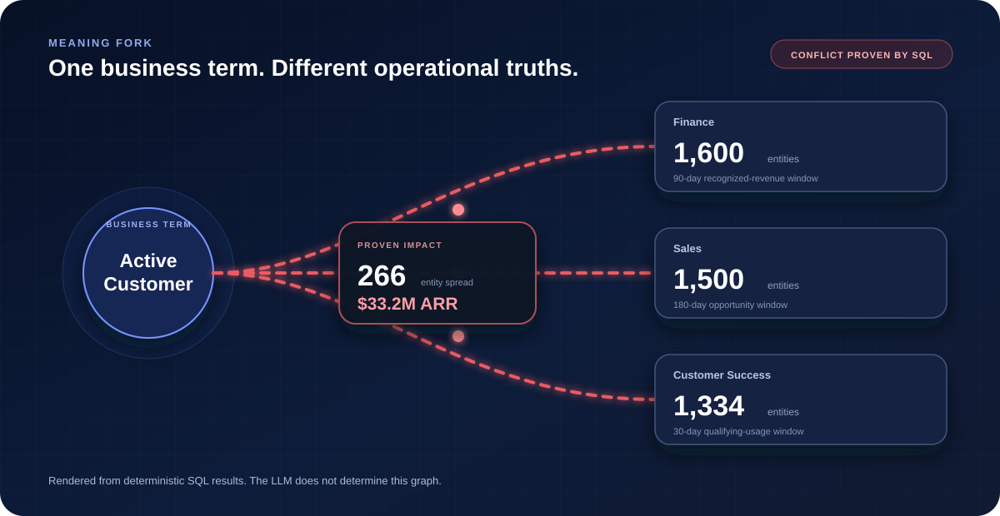
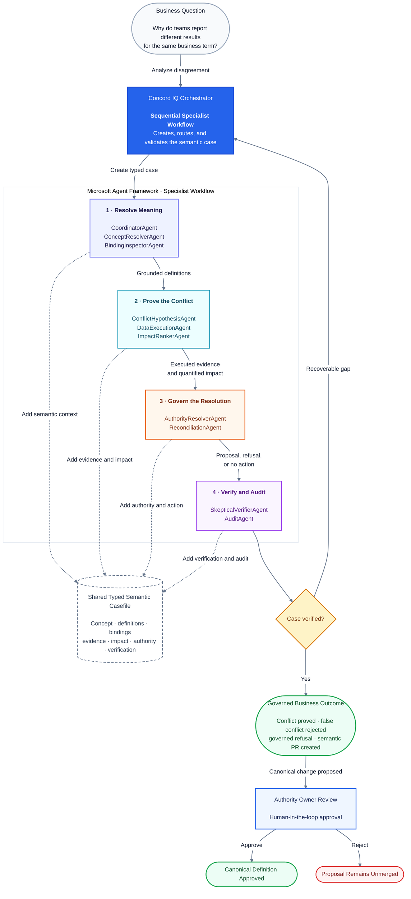

# Concord IQ

**Version control for business meaning.** 

Concord IQ is governed semantic AI that proves and resolves business definition conflicts. It grounds business meaning through Microsoft Fabric IQ, Foundry IQ, or Microsoft 365 Work IQ; executes competing definitions against data; quantifies their operational impact; and routes the resolution through a Microsoft Agent Framework workflow that can run in-process or in Microsoft Foundry Agent Service.

[](#7-microsoft-integration-truth-table)
[](#7-microsoft-integration-truth-table)
[](#7-microsoft-integration-truth-table)
[](https://www.python.org/)
[](LICENSE)

## 1. The problem, in one concrete example

> Finance reports **1,600** Active Customers. Sales reports **1,500**. Customer Success
> reports **1,334**. Concord IQ executes all three definitions, proves the **$33.2M**
> disagreement, and creates an authority-gated semantic pull request.

| Team | Definition | Count |
|---|---|---:|
| Finance | Recognized revenue in the trailing 90 days | 1,600 |
| Sales | Open or won opportunity in the trailing 180 days | 1,500 |
| Customer Success | Active contract + qualifying usage in the trailing 30 days | 1,334 |

A naming match does not prove operational equivalence. A wording difference does not
prove a real data conflict. Concord IQ settles both with executed SQL.

**What is a semantic PR?**
A semantic pull request is a reviewable, evidence-backed proposal to change a business definition. It contains the competing definitions, executed results, quantified impact, authority owner, verifier findings, and approval history.



## 2. 60-second quickstart

```bash
git clone <repo>
cd concord-iq
make setup
make dev
```

Then:

1. Open the frontend URL printed by `make dev` (`http://127.0.0.1:5173`).
2. Select **Active Customer**.
3. Click **Analyze disagreement**.

`make help` prints the full command table at any time.

## 3. One-command judge verification

```bash
make judge-proof
```

This runs the mandatory local proof, backend + frontend tests, lint/typecheck, the
deterministic eval scorecard, replay verification, the SHA-256 content-hashed semantic-PR export, and a

## Demo and evidence

- [Watch the five-minute demo](https://youtu.be/RaSYFlbIH-Q)
- [Read the judge proof report](docs/proofs/judge-proof-report.md)
- [Inspect the reproducible proof bundle](artifacts/proof/latest.json)

When the app first opens, the **Workbench**, **Reasoning**, and **Evidence** navigation
links may not scroll anywhere because no analysis result exists yet. Select a scenario
and click **Analyze disagreement**. Once the result is rendered, those links navigate to
their corresponding sections.

> Remove the video link until the final YouTube or Vimeo URL is available.

## 4. Demo modes

Only one Concord IQ development mode should run at a time. All modes use:

- Backend: `http://127.0.0.1:8000`
- Frontend: `http://127.0.0.1:5173`

### Stop the current mode before switching

```bash
make stop
```

If startup reports `address already in use`, stop any remaining listeners on ports
`8000` and `5173`:

```bash
for port in 8000 5173; do
  pids="$(lsof -tiTCP:$port -sTCP:LISTEN)"
  if [ -n "$pids" ]; then
    echo "Stopping process(es) on port $port: $pids"
    kill $pids
  fi
done
```

### Available modes

| Command | Purpose |
|---|---|
| `make dev` | Safe local mode with cloud access disabled |
| `make dev-fresh` | Reset synthetic demo state and start the cold-open local UI |
| `make dev-foundry` | Run the workflow through Microsoft Foundry Agent Service |
| `make dev-fabric` | Run with live Microsoft Fabric IQ semantic grounding |
| `make judge-proof` | Run the reproducible mandatory judge proof |
| `make cloud-proof` | Run all configured cloud proof checks |
| `make stop` | Stop Concord IQ processes tracked by the launcher |

> `make dev-fresh` always starts local synthetic mode. It does not connect to Foundry
> Agent Service or Fabric IQ.

Before running above commands, first check the details of each command below:

### Local demo

```bash
make dev
```

Use `make dev-fresh` when you want to reset the local PostgreSQL and DuckDB demo state
before recording:

```bash
make dev-fresh
```

### Foundry Agent Service

Please refer first to [Foundry Agent Service](docs/foundry-agent-service.md) and [Cloud Runtime](docs/cloud-runtime.md) for important details.

Stop any currently running Concord IQ mode:

```bash
make stop
```
Authenticate with Azure CLI and select the intended subscription:

```bash
az login
az account set --subscription "<subscription-id-or-name>"
```

Start Concord IQ with Foundry Agent Service:

```bash
ALLOW_CLOUD=true \
MAX_CLOUD_CALLS=20 \
make dev-foundry
```


ALLOW_CLOUD=true explicitly enables cloud access. MAX_CLOUD_CALLS=20 sets a bounded
cloud-call budget for the development session.


After startup, verify the active provider:

```bash
curl -s http://127.0.0.1:8000/health | python -m json.tool
```

The response should identify Foundry Agent Service and show that cloud access is enabled.

Then open:
```bash
http://127.0.0.1:5173
```

If Analyze disagreement returns:

Foundry Agent Service is disabled

restart the application using the full command above. This means ALLOW_CLOUD or MAX_CLOUD_CALLS was not passed to the backend process.

### Fabric IQ

Authenticate with Azure CLI and select the intended subscription:

```bash
az login
az account set --subscription "<subscription-id-or-name>"
```

Then start live Fabric IQ grounding:

```bash
make dev-fabric
```

In Fabric IQ mode, the health endpoint may report:

```json
{
  "provider": "FabricIQProvider",
  "cloud_enabled": true,
  "data_type": "synthetic"
}
```

This is expected. Fabric IQ supplies the live semantic grounding, while the seeded local
DuckDB dataset provides reproducible SQL execution and evidence.

### Verify the active provider

After starting any mode, run:

```bash
curl -s http://127.0.0.1:8000/health | python -m json.tool
```

Confirm that the response identifies the expected provider before opening:

```text
http://127.0.0.1:5173
```

If the browser still shows an earlier provider after the health check succeeds, perform a
hard refresh.

### Work IQ status

Work IQ is implemented and permission-tested, but live retrieval is currently
license-gated in the available tenant. It is therefore excluded from the standard demo
commands above.

The implementation and proof status remain documented in:

- [Microsoft IQ integration](docs/iq-integration.md)
- [Work IQ license-gate proof](docs/proofs/work-iq-license-gate.md)

Run `make cloud-proof` to report the current Work IQ status without presenting
`LICENSE-GATED` as a successful live integration.


## 5. How Concord IQ works


>Ground the meaning. Prove the impact. Govern the resolution.

Semantic grounding informs the case. Deterministic SQL owns the verdict. Configured governance determines authority. Humans approve canonical promotion. Optional LLM narration explains the verified result but cannot change evidence, counts, verdicts, authority decisions, refusals, or approvals.

Microsoft Agent Framework coordinates ten specialist nodes through a typed casefile. The skeptical verifier blocks unsupported cases, and ambiguous authority causes a governed refusal rather than a guess.

```text
CoordinatorAgent -> ConceptResolverAgent -> BindingInspectorAgent -> ConflictHypothesisAgent -> DataExecutionAgent -> ImpactRankerAgent -> AuthorityResolverAgent -> ReconciliationAgent -> SkepticalVerifierAgent -> AuditAgent
```

The reviewer workbench leads with the meaning fork: executed definitions produce different customer populations, the deterministic what-if control updates the quantified business impact, authority refusal leaves the conflict unresolved, and an owner-approved canonical definition collapses it into one governed version.

More detail is available in [architecture](docs/architecture.md) and [IQ integration](docs/iq-integration.md).

### Concord IQ multi-agent orchestration

Concord IQ uses Microsoft Agent Framework to coordinate a sequential workflow of ten
specialist agents over a shared typed semantic casefile. Each stage performs one bounded
responsibility: resolve the business meaning, execute deterministic proof, quantify the
impact, resolve governance authority, verify the evidence, and produce an auditable
business outcome.



The orchestrator creates and routes a typed semantic casefile through four functional
agent groups. Semantic grounding informs the case, deterministic execution proves the
result, configured governance identifies the accountable authority, and the skeptical
verifier blocks unsupported outcomes. Canonical promotion remains subject to human
approval.

### Model support and extensibility

Concord IQ separates model-generated explanation from deterministic decision-making.

The current repository includes:

* `disabled` mode for fully deterministic and reproducible runs
* an optional local Ollama narration provider
* a provider-neutral `LLMProvider` interface for future hosted-model integrations

The provider interface is designed so Microsoft Foundry-hosted GPT, Claude, or other
compatible models can be added without changing the reconciliation, evidence,
governance, verification, or approval pipeline.

Models may be used to:

* explain verified conflicts in business language
* summarize verifier findings
* produce readable audit narratives
* draft stakeholder communications from approved evidence

Models cannot change:

* executed SQL or result sets
* conflict verdicts or quantified impact
* governance authority
* refusal decisions
* semantic PR approval
* canonical definition promotion

> **Current implementation:** optional Ollama narration

> **Planned extensibility:** GPT, Claude, and other hosted model providers through the existing provider interface


## 6. Getting started in depth

Prerequisites and the full local workflow (seed, scan, score, replay) are in
[getting started](docs/getting-started.md). The recordable narrative is in
[demo script](docs/demo-script.md).

## 7. Microsoft integration truth table

| Capability | Role | Proof status |
|---|---|---|
| Microsoft Agent Framework | 10-step specialist workflow | Implemented and tested |
| Foundry Agent Service | Hosted runtime | Real deployment/invocation recorded |
| Fabric IQ | Semantic grounding | Verified sanitized capture + replay |
| Foundry IQ | Advisory authority grounding | Integrated and transport-tested; no real-tenant capture |
| Work IQ | M365 artifact grounding | Implemented and permission-tested; live retrieval currently license-gated |
| Deterministic SQL | Verdict engine | Local/replay verified |
| Skeptical verifier | Blocking safety gate | Deterministic tests and evals pass |

These are distinct facts and are never collapsed into a single "Microsoft IQ passed"
claim. Work IQ is reported as `passed` only when a live Microsoft Graph retrieval returns
at least one hit; until the tenant is entitled it stays `license_gated`.

## 8. Proof bundle

- [`docs/proofs/README.md`](docs/proofs/README.md) — proof index
- [`docs/proofs/judge-proof-report.md`](docs/proofs/judge-proof-report.md) — mandatory local proof
- [`docs/proofs/foundry-agent-service-smoke.md`](docs/proofs/foundry-agent-service-smoke.md) — recorded hosted invocation
- [`docs/proofs/work-iq-license-gate.md`](docs/proofs/work-iq-license-gate.md) — honest Work IQ status
- [`artifacts/replay/sanitized/latest.json`](artifacts/replay/sanitized/latest.json) — verified Fabric IQ replay capture
- [`docs/eval-scorecard.md`](docs/eval-scorecard.md) — deterministic safety scorecard

Run the optional live cloud proofs with one command:

```bash
make cloud-proof
```

## 9. Repository map

```text
backend/concord/
  agents/          deterministic specialist agents
  analytics/       DuckDB execution utilities
  api/             FastAPI reconciliation and demo routes
  cloud_auth.py    runtime token acquisition (Azure CLI + MSAL)
  dev_launcher.py  safe local / cloud dev-stack launcher
  evals/           deterministic safety scorecard
  llm/             disabled/local narration providers
  ms_agent/        Microsoft Agent Framework workflow + Foundry host
  orchestration/   casefile and typed state machine
  providers/       Local, Replay, Fabric IQ, Foundry IQ, Work IQ, Foundry hosted
  seed/            fixed-seed synthetic generator
  storage/         SQLAlchemy registry models
frontend/          React/Vite reviewer workbench
docs/              architecture, getting started, cloud runtime, proofs, demo
artifacts/replay/  raw (ignored) and sanitized (committed) captures
tests/             deterministic acceptance tests
```

## 10. License

Concord IQ is licensed under the [Apache License 2.0](LICENSE), including its explicit
patent grant.
