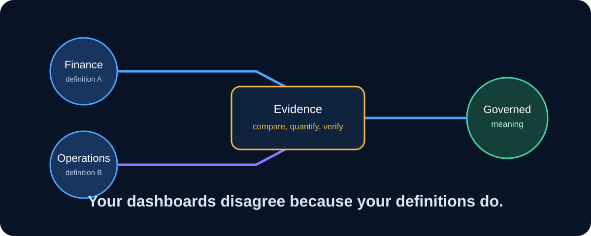
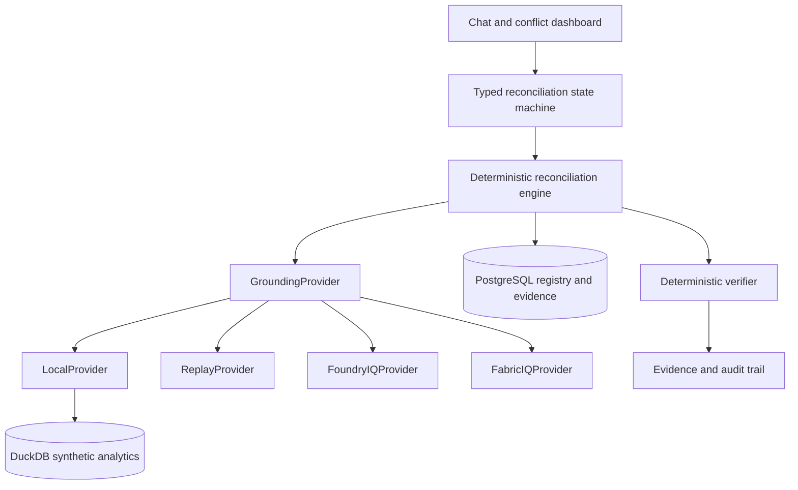
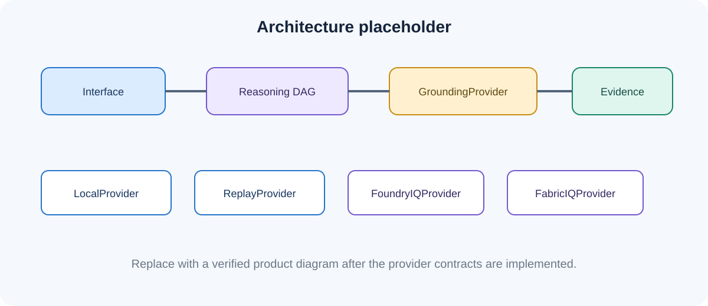
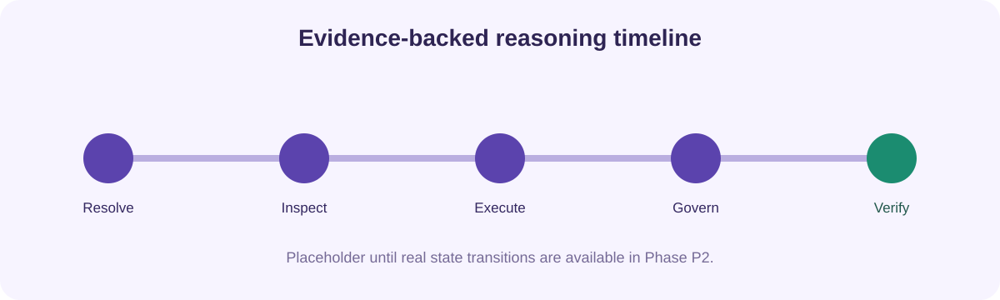

# Concord IQ

**The semantic reconciliation agent for enterprise meaning.**

[](#hackathon-alignment)
[](#hackathon-alignment)
[](#microsoft-iq-architecture)
[](https://www.python.org/)
[](#implementation-status)
[](#license)



> Enterprises built a single source of truth for data, but not for meaning.

Finance, Sales, and Customer Success can use the same business term while binding
it to different filters, time windows, populations, grains, and sources. Concord IQ
is designed to find those differences, execute each definition against data, rank
the material impact, and propose a governed semantic reconciliation. When authority
is shared or ambiguous, it refuses to choose and routes the decision to a human.

## Implementation status

The deterministic product runs all three synthetic scenarios end to end through
the typed state machine, specialist agents, skeptical verifier, PostgreSQL
evidence store, API, headless demo, and React reviewer workbench.

Phase P5 adds guarded Foundry IQ and Fabric IQ adapters, typed capture/replay, a
provider status endpoint, and product documentation. This workspace had no
configured Microsoft tenant, so the required real IQ smoke capture remains
blocked. No sanitized artifact or successful Microsoft IQ call is claimed.

## Why it matters

- Board meetings stall when dashboards disagree on a metric nobody has defined once.
- A naming match does not prove operational equivalence.
- A wording difference does not prove a real data conflict.
- Choosing a canonical definition is a governance decision, not a text-generation task.
- Reconciliation needs evidence: selected entities, exact SQL, impact, authority, and audit.

## What Concord IQ does

When complete, Concord IQ will:

1. Resolve a business term to every registered operational definition.
2. Compare filters, time windows, grain, exclusions, source tables, and ownership.
3. Execute each definition in DuckDB and compare the resulting entity sets.
4. Reject wording-only differences when the data results are equal.
5. Quantify population and revenue impact when the results diverge.
6. Consult deterministic authority rules before proposing a canonical definition.
7. Refuse automatic reconciliation when ownership is shared, missing, or ambiguous.
8. Persist the SQL, evidence, verifier result, proposal, and audit trail.

## The three demo cases

| Business term | Seeded operational difference | Intended behavior |
| --- | --- | --- |
| Active Customer | Finance uses recent recognized revenue, Sales uses recent open/won opportunity, Customer Success uses an active contract plus qualifying usage | Detect a material three-way conflict and rank it high |
| Net Revenue | Finance and Sales wording differs while both bindings select the same seeded result | Rule it consistent by result-set equality |
| Churned Customer | Finance uses contract end; Customer Success uses prolonged inactivity and grace | Detect divergence, then refuse because authority is shared |

The deterministic generator creates the synthetic analytical tables and cohorts.
No real customer or tenant data is used.

## Demo in five minutes

### Prerequisites

- Docker Desktop with Docker Compose v2
- [`uv`](https://docs.astral.sh/uv/) for Python 3.12 environment management
- Node.js, pnpm, and GNU Make

### Build the local foundation

```bash
make setup
```

This installs Python dependencies, starts PostgreSQL 16, waits for readiness, and
creates the semantic registry schema.

### Regenerate synthetic analytics data

```bash
make seed
```

The command writes deterministic CSV fixtures to `data/synthetic/` and loads the
same rows into the ignored local database `data/concord_iq.duckdb`.

### Verify the reasoning core

```bash
make lint
make test
```

The suite covers seed determinism, provider and replay contracts, conflict and
equivalence verdicts, authority-driven refusal, evidence persistence, cloud
budgets, capture sanitization, context scope, the demo, and the API.

### Run all three scenarios headlessly

```bash
make demo
```

Expected verdicts:

```text
Active Customer: CONFLICT | counts=96/90/80 | proposal drafted; human approval required
Net Revenue: CONSISTENT | counts=96/96 | decoy ruled out; no reconciliation needed
Churned Customer: CONFLICT | counts=20/40 | automatic reconciliation refused; human approval required
```

### Run the reviewer workbench

```bash
make dev
```

Open `http://127.0.0.1:5173` for the UI or `http://127.0.0.1:8000/docs` for
the API. The workbench exposes provider safety, definitions, impact, the full
reasoning timeline, verifier status, governed outcome, and exact SQL evidence.

## Architecture

Concord IQ separates semantic grounding from optional language generation. The
deterministic truth path is SQL result-set comparison plus authority-rule lookup.
An LLM may eventually narrate already verified evidence, but it cannot alter a
conflict verdict, authority decision, or stored result.





### Storage split

**PostgreSQL** stores semantic and governance state:

- business units and business terms
- metric definitions and executable bindings
- ontology entities and relationships
- authority rules
- reconciliation runs and conflict findings
- evidence items, proposals, and audit events

**DuckDB** runs deterministic analytical comparisons over:

- customers
- contracts
- opportunities
- usage events
- revenue events
- churn events
- reports

## How it reasons

The orchestration is a blackboard casefile driven by a typed DAG:

```text
START
  -> RESOLVE_CONCEPT
  -> INSPECT_BINDINGS
  -> HYPOTHESIZE_CONFLICTS
  -> EXECUTE_DEFINITIONS
  -> RANK_IMPACT
  -> RESOLVE_AUTHORITY
  -> PROPOSE_OR_REFUSE
  -> VERIFY
  -> AUDIT
  -> COMPLETE
```

Each specialist receives a compact context packet and writes typed output back to
the casefile. Blocking verifier checks remain deterministic. Advisory language-model
critique can never pass unsupported evidence or overrule a refusal.



## Microsoft IQ architecture

The grounding layer keeps four modes explicit:

| Provider | Role | Current status |
| --- | --- | --- |
| `LocalProvider` | Deterministic development and reviewer mode over local registry and synthetic data | Resolves concepts, returns bindings/subgraphs/rules, and executes definitions |
| `ReplayProvider` | Replays a reviewed real-IQ capture through the same typed contract | Implemented; refuses missing or unverified artifacts |
| `FoundryIQProvider` | Azure AI Search knowledge-base retrieval | Guarded adapter and injected-transport tests complete; tenant smoke test pending |
| `FabricIQProvider` | Fabric IQ ontology MCP | Guarded MCP adapter and injected-transport tests complete; tenant smoke test pending |

`LocalProvider` is the reproducibility scaffold. It is not presented as Microsoft
IQ and does not satisfy the final IQ-integration goal by itself. The cloud adapters
never fall back to it silently.

The real-integration gate requires a tiny manually enabled smoke test, ignored raw
response, reviewed sanitized copy, and successful `ReplayProvider` run. See
[IQ integration](docs/iq-integration.md) and
[replay artifact policy](artifacts/replay/README.md).

## Cloud and cost safety

Cloud access starts disabled:

```text
PROVIDER=local
ALLOW_CLOUD=false
MAX_CLOUD_CALLS=0
LLM_PROVIDER=disabled
```

`FabricIQProvider` and `FoundryIQProvider` fail closed unless explicit cloud
permission, a positive call budget, endpoint, and authentication are configured.
Automated tests use injected transports and never call Microsoft services.

**Do not assume Foundry, Fabric, or IQ usage is free or unlimited. Verify current
Microsoft pricing, trial limits, tenant settings, and permissions before enabling
cloud mode. Keep datasets tiny, use cloud only for smoke tests, pause or delete
idle resources, and replay sanitized captured responses through ReplayProvider
for demo rehearsal.**

Raw provider responses belong in `artifacts/replay/raw/` and are ignored. Only a
reviewed, synthetic-only, secret-free response may be placed in
`artifacts/replay/sanitized/`.

Manual capture is available through `make capture`; configuration and review steps
are documented in [cost controls](docs/cost-controls.md). No verified capture is
currently committed.

## Reliability principles

- Fixed random seed and fixed reference date
- Synthetic data only
- Typed PostgreSQL model and provider boundaries
- Deterministic SQL as the source of truth
- Exact SQL retained as evidence
- Result-set equality for decoy rejection
- Configuration lookup for authority and refusal
- Cloud off by default
- No LLM required for core behavior
- Honest implementation-status documentation

## Optional local LLM

The core runs with `LLM_PROVIDER=disabled`. A future optional Ollama mode may
narrate verified findings, but it cannot replace evidence, SQL, or authority rules.

## Synthetic data contract

The generator uses seed `20260606`, reference date `2026-06-01`, 120 customers,
stable identifiers, and deterministic cohorts, amounts, dates, regions, and
segments. Committed CSVs make the fixtures inspectable; the reproducible DuckDB
file remains local-only.

## Project structure

```text
backend/concord/
  agents/          deterministic specialist agents
  analytics/       DuckDB execution utilities
  api/             FastAPI reconciliation and demo routes
  evals/           scenario evaluation
  llm/             disabled/local/cloud narration providers
  orchestration/   casefile and typed state machine
  providers/       Local, Replay, Foundry IQ, Fabric IQ
  seed/            fixed-seed synthetic generator
  storage/         SQLAlchemy registry models
frontend/           React/Vite reviewer workbench
data/synthetic/    committed synthetic CSV fixtures
tests/             deterministic acceptance tests
docs/assets/       honest graphic placeholders
docs/*.md           architecture, integration, demo, safety, submission
artifacts/replay/
  raw/             ignored captures
  sanitized/       committed reviewed replays
```

Private prompts, planning files, agent instructions, and local checkpoint memory
are excluded from version control. A clean public clone depends only on product
files.

## Evaluation

Current acceptance status:

| Phase | Acceptance focus |
| --- | --- |
| P0 | Repeatable synthetic seed |
| P1 | Ontology resolution, bindings, and LocalProvider execution |
| P2 | Active Customer conflict, impact rank, evidence, cloud guard |
| P3 | Net Revenue decoy, Churned Customer refusal, headless demo — complete |
| P4 | Reviewer-facing demo interface and reasoning timeline — complete |
| P5 | Adapters, guards, replay contract, capture command, docs — real capture blocked |

## Hackathon alignment

**Reasoning Agents:** Concord IQ decomposes reconciliation into concept resolution,
binding inspection, data execution, impact ranking, authority resolution, proposal
or refusal, verification, and audit.

**Best Use of IQ Tools:** Fabric IQ is the target ontology surface, with an Azure
AI Search knowledge base as the Foundry path. The integration claim becomes
complete only after a real adapter smoke test and sanitized replay exist.

**Reliability and safety:** The system is designed to reject false conflicts, refuse
unsupported governance choices, preserve evidence, and keep cloud access opt-in.

## Roadmap

- [x] P0: repository, storage models, deterministic seed, test, README
- [x] P1: ontology, authority rules, metric definitions, `LocalProvider`
- [x] P2: Active Customer reasoning engine and persisted evidence
- [x] P3: Net Revenue decoy, Churned Customer refusal, `make demo`
- [x] P4: demo-first React interface
- [ ] P5: adapters, capture/replay, docs; real IQ capture still required
- [ ] P6: optional Ollama narration

## Limitations

- The three implemented verdicts cover fixed, reviewed synthetic scenarios rather
  than arbitrary business concepts.
- The data is synthetic and intentionally engineered for known evaluation cases.
- Behavioral equivalence is proven only over the bound data and period being tested.
- Microsoft IQ preview surfaces, pricing, permissions, and availability can change.
- The guarded adapters are not tenant-verified in this workspace.
- No production-readiness claim is made.

## AI-assisted development

Concord IQ uses AI-assisted engineering with tests, deterministic data, reviewable
code, and explicit status labels.

## License

A public license has not been selected yet. Until one is added, normal copyright
restrictions apply.
