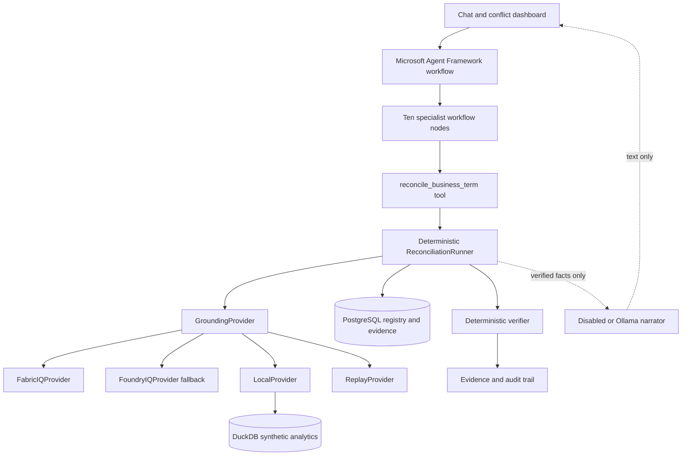

# Concord IQ

**The semantic reconciliation agent for enterprise meaning.**

[](#hackathon-alignment)
[](#hackathon-alignment)
[](#microsoft-iq-architecture)
[](https://www.python.org/)
[](#implementation-status)
[](#license)


> Enterprises built a single source of truth for data, but not for meaning.

Finance, Sales, and Customer Success can use the same business term while binding
it to different filters, time windows, populations, grains, and sources. Concord IQ
is designed to find those differences, execute each definition against data, rank
the material impact, and propose a governed semantic reconciliation. When authority
is shared or ambiguous, it refuses to choose and routes the decision to a human.

## Implementation status

Concord IQ is **built with Microsoft Agent Framework** as the orchestration layer
and is **prepared for Foundry Agent Service hosted deployment**. Specialist agents
coordinate through a typed casefile and call deterministic reconciliation tools.
The Agent Framework workflow runs in two modes: a **fast** mode (default, stable)
and a **strict** mode in which each specialist node executes exactly one reasoning
stage and writes its typed output into the casefile — no single call performs the
whole reasoning. Fabric IQ is the primary semantic grounding provider, with Foundry
IQ as fallback and LocalProvider for reproducible public review.

The Foundry Agent Service hosting protocol is **validated locally with a cloud-free
hosted smoke test** (`make foundry-agent-smoke`) over LocalProvider or a verified
ReplayProvider artifact — no Fabric credentials required. Guarded Foundry IQ and
Fabric IQ adapters, typed capture/replay, Fabric bootstrap helpers, optional local
narration, a deterministic verifier that blocks unsupported cases, and a per-run
agent trace are implemented. The Fabric REST and MCP surfaces are verified against
current Microsoft Learn (see [IQ integration](docs/iq-integration.md)).

Two external gates remain deliberately open: no Microsoft tenant was available, so
**no real Fabric IQ capture and no Foundry Agent Service tenant deployment are
claimed**. ReplayProvider replays a sanitized, verified IQ capture only after
`make capture` succeeds against a real tenant.

Beyond one-off detection, Concord IQ **watches, scores, and gates**: an autonomous
portfolio scan ranks every conflict, a Concord Score grades organizational
semantic health, a natural-language chat surface grounds questions through
NL2Ontology, and a Semantic-PR approval gate merges canonical definitions only
with the configured authority owner.

## Why it matters

- Board meetings stall when dashboards disagree on a metric nobody has defined once.
- A naming match does not prove operational equivalence.
- A wording difference does not prove a real data conflict.
- Choosing a canonical definition is a governance decision, not a text-generation task.
- Reconciliation needs evidence: selected entities, exact SQL, impact, authority, and audit.

## What Concord IQ does

Concord IQ:

1. Resolve a business term to every registered operational definition.
2. Compare filters, time windows, grain, exclusions, source tables, and ownership.
3. Execute each definition in DuckDB and compare the resulting entity sets.
4. Reject wording-only differences when the data results are equal.
5. Quantify population and revenue impact when the results diverge.
6. Consult deterministic authority rules before proposing a canonical definition.
7. Refuse automatic reconciliation when ownership is shared, missing, or ambiguous.
8. Persist the SQL, evidence, verifier result, proposal, and audit trail.
9. Answer natural-language questions grounded in the ontology (`POST /ask`).
10. Sweep every concept and rank conflicts by business impact (`make scan`, `GET /scan`).
11. Grade organizational semantic health as a single Concord Score (`GET /score`).
12. Gate canonical definitions behind owner-only approval (`POST /proposals/{id}/approve`).

## Beyond detection — watch, score, and gate

A conflict report gets read once. Concord IQ is built to be returned to, because
it inserts itself into a workflow teams cannot skip:

- **Ask in business terms.** `POST /ask` resolves a natural-language question
  through the ontology (NL2Ontology on Fabric IQ, deterministic locally), names
  the competing definitions, and runs the proof. Not free-text retrieval.
- **The autonomous scan.** `make scan` / `GET /scan` sweeps every governed
  concept, ranks conflicts by ARR impact, and surfaces problems nobody asked
  about — the agent that watches, not just answers.
- **The Concord Score.** `GET /score` grades organizational semantic health on a
  single 0–100 scale with a per-business-unit leaderboard.
- **Semantic pull requests.** A canonical definition is reviewed like code:
  `POST /proposals/{id}/approve|reject` merges only with the configured authority
  owner, is idempotent, and is written to the audit trail. Ambiguous ownership is
  refused, not guessed.

All four are deterministic and evidence-backed; the LLM never decides any of them.

## The demo scenarios

| Business term | Seeded operational difference | Intended behavior |
| --- | --- | --- |
| Active Customer | Finance uses recent recognized revenue, Sales uses recent open/won opportunity, Customer Success uses an active contract plus qualifying usage | Detect a material three-way conflict (1,600 / 1,500 / 1,334; $33.2M ARR delta) and rank it high |
| Net Revenue | Finance and Sales wording differs while both bindings select the same seeded result | Rule it consistent by result-set equality (1,600 / 1,600) |
| Churned Customer | Finance uses contract end; Customer Success uses prolonged inactivity and grace | Detect divergence (333 / 666), then refuse because authority is shared |
| Qualified Lead | Sales counts open/won; Marketing also counts a small `nurturing` cohort | Catch the subtle 20-customer (1.3%, $2.26M) gap and quantify it |

The first three drive `make demo` and the Fabric capture set. Qualified Lead is
the "subtle catch" — it surfaces in `make scan` and the chat/`/reconcile` path
and is deliberately kept out of the capture set to keep cloud spend at six calls.
The deterministic generator creates the synthetic analytical tables and cohorts.
No real customer or tenant data is used.

## Demo in five minutes

### Prerequisites

- Docker Desktop with Docker Compose v2
- [`uv`](https://docs.astral.sh/uv/) for Python 3.12 environment management
- Node.js, pnpm, and GNU Make

### Build the local foundation

```bash
make setup
```

This installs Python dependencies, starts PostgreSQL 16, waits for readiness, and
creates the semantic registry schema.

### Regenerate synthetic analytics data

```bash
make seed
```

The command writes deterministic CSV fixtures to `data/synthetic/` and loads the
same rows into the ignored local database `data/concord_iq.duckdb`.

### Verify the reasoning core

```bash
make lint
make test
```

The suite covers seed determinism, provider and replay contracts, conflict and
equivalence verdicts, the subtle Qualified Lead catch, authority-driven refusal,
the portfolio scan and Concord Score, the owner-only approval gate, NL-query
grounding, evidence persistence, cloud budgets (including the six-call Fabric
capture), capture sanitization, context scope, the demo, and the API.

### Run all three scenarios headlessly

```bash
make demo
```

Expected verdicts:

```text
Active Customer: CONFLICT | counts=1600/1500/1334 | proposal drafted; human approval required
Net Revenue: CONSISTENT | counts=1600/1600 | decoy ruled out; no reconciliation needed
Churned Customer: CONFLICT | counts=333/666 | automatic reconciliation refused; human approval required
```

### Scan the whole semantic portfolio

```bash
make scan
```

This sweeps every concept and prints the Concord Score, the impact-ranked
conflict board (including the concepts it checked and cleared), and the per-team
semantic-health leaderboard:

```text
Concord Score: 60/100 (grade D) | 3 conflicts, 1 consistent, 1 refusal(s) across 4 concepts
  [ #1] Churned Customer   CONFLICT   ... action=refuse  authority=ambiguous
  [ #2] Active Customer    CONFLICT   ... action=propose authority=clear
  [ #3] Qualified Lead     CONFLICT   ... action=propose authority=clear
  [ ok] Net Revenue        CONSISTENT ... action=monitor authority=clear
```

### Run the reviewer workbench

```bash
make dev
```

Open `http://127.0.0.1:5173` for the UI or `http://127.0.0.1:8000/docs` for
the API. The workbench exposes provider safety, definitions, impact, the full
reasoning timeline, verifier status, governed outcome, and exact SQL evidence.

### Bootstrap Fabric and prove replay

Start with a cloud-free plan and regenerate the committed synthetic seed package:

```bash
make fabric-bootstrap-dry-run
```

After verifying current pricing, capacity, tenant permissions, and preview API
availability, copy `.env.example` to a local `.env`, authenticate with a
short-lived `FABRIC_IQ_ACCESS_TOKEN` or `az login`, and opt in:

```bash
ALLOW_CLOUD=true make fabric-bootstrap
```

The bootstrap creates or reuses the named workspace, lakehouse, and ontology
where supported, attempts the preview ontology definition import, and prints IDs
plus the ontology MCP endpoint for manual `.env` entry. It never writes `.env` or
prints the token. If preview import fails, the created resources are preserved and
the command prints a Fabric UI fallback using `fabric_seed/`.

Once the ontology is published and the MCP endpoint and fresh token are configured,
diagnose first — entity types alone carry no retrievable content, so Fabric IQ must
expose the scenario **snapshot JSON** (the bootstrap uploads
`fabric_seed/concord_iq_scenarios.json` to the lakehouse for exactly this):

```bash
PROVIDER=fabric_iq ALLOW_CLOUD=true MAX_CLOUD_CALLS=6 make fabric-mcp-diagnose
```

It reports one of three states — `Full snapshot JSON: FOUND`, `Semantic proof:
FOUND`, or `No useful Fabric content found` (sanitized copy in
`artifacts/replay/raw/diagnostic.json`, no tokens). Run capture once it reports
either FOUND:

```bash
PROVIDER=fabric_iq ALLOW_CLOUD=true MAX_CLOUD_CALLS=6 make capture
make replay-check
```

**Two honest capture modes.** Fabric IQ is used as the semantic grounding layer.
In tenants where ontology MCP returns searchable ontology concepts but not full
scenario JSON, Concord IQ records the real Fabric semantic proof (the MCP matched
`ActiveCustomer` / `NetRevenue` / `ChurnedCustomer`) and attaches the deterministic
synthetic scenario snapshot from `LocalProvider` for SQL/evidence replay — marked
transparently with `iq_proof_mode` and `snapshot_source`. Concord IQ does **not**
claim Fabric returned the full snapshot unless full-snapshot mode actually
succeeds; it claims "verified Fabric IQ semantic grounding" only after `make
capture` and `make replay-check` pass with real Fabric calls.

`make replay-check` rejects shallow connectivity captures, unverified provenance,
missing semantic evidence, missing scenarios, fake or incomplete semantic proof,
and obvious secrets before running the full demo through `ReplayProvider` with
cloud disabled. The capacity prerequisites and the F2 pause-when-idle budget
runbook (target well under EUR 100) are in
[cost controls](docs/cost-controls.md) and [IQ integration](docs/iq-integration.md).

## Architecture

The layering, from deployment down to grounding:

| Layer | Responsibility | Status |
| --- | --- | --- |
| **Foundry Agent Service** | Hosts/deploys the Agent Framework workflow | Hosting protocol validated cloud-free; no tenant deployment claimed |
| **Microsoft Agent Framework** | Orchestrates the specialist agents and workflow states (fast + strict modes) | Implemented and tested locally |
| **Concord IQ deterministic tools** | Execute SQL, evidence, authority, verifier, audit — the truth path | Implemented and tested |
| **Fabric IQ** | Primary semantic ontology grounding (ontology MCP + NL2Ontology) | Adapter + verified surfaces; real capture pending |
| **Foundry IQ** | Fallback knowledge grounding (Azure AI Search) | Adapter implemented; tenant smoke pending |
| **ReplayProvider** | Sanitized Microsoft IQ replay (after `make capture` succeeds) | Implemented; refuses unverified artifacts |
| **LocalProvider** | Deterministic reviewer mode over synthetic data | Implemented |

Microsoft Agent Framework owns application orchestration. Its specialist workflow
nodes pass a typed casefile and call the existing deterministic
`ReconciliationRunner` as a domain tool. The truth path remains SQL result-set
comparison plus authority-rule lookup. Optional local narration cannot alter a
conflict verdict, authority decision, or stored result.




### Storage split

**PostgreSQL** stores semantic and governance state:

- business units and business terms
- metric definitions and executable bindings
- ontology entities and relationships
- authority rules
- reconciliation runs and conflict findings
- evidence items, proposals, and audit events

**DuckDB** runs deterministic analytical comparisons over:

- customers
- contracts
- opportunities
- usage events
- revenue events
- churn events
- reports

## How it reasons

Microsoft Agent Framework coordinates these workflow nodes:

```text
CoordinatorAgent -> ConceptResolverAgent -> BindingInspectorAgent
-> ConflictHypothesisAgent -> DataExecutionAgent -> ImpactRankerAgent
-> AuthorityResolverAgent -> ReconciliationAgent
-> SkepticalVerifierAgent -> AuditAgent
```

The domain tool advances the existing typed reconciliation state machine:

```text
START
  -> RESOLVE_CONCEPT
  -> INSPECT_BINDINGS
  -> HYPOTHESIZE_CONFLICTS
  -> EXECUTE_DEFINITIONS
  -> RANK_IMPACT
  -> RESOLVE_AUTHORITY
  -> PROPOSE_OR_REFUSE
  -> VERIFY
  -> AUDIT
  -> COMPLETE
```

**Fast vs strict mode.** In **fast** mode (default) the coordinator invokes
`reconcile_business_term(term, period, provider)` and the framework nodes expose
the resulting trace. In **strict** mode (`AGENT_WORKFLOW_MODE=strict`, the default
for the Foundry hosted smoke) the Agent Framework owns the progression: each
specialist node executes exactly one stage and writes its typed output into the
shared casefile — no single call performs the whole reasoning. Both modes reach
the same deterministic verdict; only the orchestration granularity differs.

**Verifier guard.** The skeptical verifier checks required evidence IDs, stored
SQL, divergent-vs-equal result sets, authority status, and proposal/refusal
validity. On failure the case is marked `blocked` or `needs_review`; a single
recovery retry is allowed for a recoverable missing-step output, and the verifier
never invents evidence to pass. Advisory language-model critique can never pass
unsupported evidence or overrule a refusal.

**Agent trace.** Every run emits a typed trace — step number, agent, input/output
summary, evidence IDs, provider mode, verifier status, and duration — persisted and
served at `GET /runs/{run_id}/agent-trace` and surfaced in the reviewer workbench,
so the multi-agent pattern is visible rather than implied.


## Microsoft IQ architecture

The grounding layer keeps four modes explicit:

| Provider | Role | Current status |
| --- | --- | --- |
| `LocalProvider` | Deterministic development and reviewer mode over local registry and synthetic data | Resolves concepts, returns bindings/subgraphs/rules, and executes definitions |
| `ReplayProvider` | Replays a reviewed real-IQ capture through the same typed contract | Implemented; refuses missing or unverified artifacts |
| `FabricIQProvider` | Primary cloud grounding through Fabric IQ ontology MCP + NL2Ontology | Guarded MCP adapter; REST/MCP surfaces verified against Microsoft Learn (2026-06); tenant smoke test pending |
| `FoundryIQProvider` | Fallback cloud grounding through Azure AI Search knowledge-base retrieval | Guarded adapter and injected-transport tests complete; tenant smoke test pending |

The `nl_query` path is genuinely IQ-served: on Fabric/Foundry it calls the real
NL2Ontology/retrieve surface, while Local/Replay answer the same typed contract
deterministically. The Fabric bootstrap and adapter endpoints (create ontology,
`updateDefinition`, list items by `ItemType=Ontology`, the MCP `ontologyEndpoint`)
are confirmed against current Microsoft Learn; F2 is the minimum supported SKU.

`LocalProvider` is the reproducibility scaffold. It is not presented as Microsoft
IQ and does not satisfy the final IQ-integration goal by itself. The cloud adapters
never fall back to it silently.

The real-integration gate requires a tiny manually enabled smoke test, ignored raw
response, reviewed sanitized copy, and successful `ReplayProvider` run. See
[IQ integration](docs/iq-integration.md) and
[replay artifact policy](artifacts/replay/README.md).

## Foundry Agent Service deployment

The Agent Framework workflow is the deployment unit for Foundry Agent Service.
Concord IQ is **Foundry Agent Service-ready**: the hosting protocol is validated
**without any cloud call or Fabric credentials**.

```bash
make foundry-agent-dry-run     # constructs the host, checks routes, no cloud, no socket
make foundry-agent-smoke       # full /responses path in process over LocalProvider (strict mode)
FOUNDRY_AGENT_PROVIDER=replay make foundry-agent-smoke   # same path over a verified replay artifact
```

The smoke proves the full chain end to end with no tenant:
**Foundry hosted entrypoint → Microsoft Agent Framework workflow → Concord IQ
deterministic tool → ReplayProvider or LocalProvider → semantic reconciliation
result** (verifier `passed`, all ten specialist trace steps). Real `auto` hosting
fails closed unless cloud access, a positive budget, and a real IQ provider are
explicit, and never falls back to local silently.

See [Foundry Agent Service](docs/foundry-agent-service.md) and
[the Agent Framework integration guide](backend/concord/ms_agent/README.md). This
repository validates the hosting protocol locally; it does **not** claim a Foundry
Agent Service tenant deployment.

## Cloud and cost safety

Cloud access starts disabled:

```text
PROVIDER=local
ALLOW_CLOUD=false
MAX_CLOUD_CALLS=0
LLM_PROVIDER=disabled
```

`FabricIQProvider` and `FoundryIQProvider` fail closed unless explicit cloud
permission, a positive call budget, endpoint, and authentication are configured.
Automated tests use injected transports and never call Microsoft services.

**Do not assume Foundry, Fabric, or IQ usage is free or unlimited. Verify current
Microsoft pricing, trial limits, tenant settings, and permissions before enabling
cloud mode. Keep datasets tiny, use cloud only for smoke tests, pause or delete
idle resources, and replay sanitized captured responses through ReplayProvider
for demo rehearsal.**

Raw provider responses belong in `artifacts/replay/raw/` and are ignored. Only a
reviewed, synthetic-only, secret-free response may be placed in
`artifacts/replay/sanitized/`.

The complete bootstrap, capture, and replay workflow is documented in
[IQ integration](docs/iq-integration.md) and
[cost controls](docs/cost-controls.md). No verified capture is currently committed.

## Reliability principles

- Fixed random seed and fixed reference date
- Synthetic data only
- Typed PostgreSQL model and provider boundaries
- Deterministic SQL as the source of truth
- Exact SQL retained as evidence
- Result-set equality for decoy rejection
- Configuration lookup for authority and refusal
- Cloud off by default
- No LLM required for core behavior
- Honest implementation-status documentation

## Optional local LLM

The core runs with `LLM_PROVIDER=disabled`. To add local proposal, verifier, and
audit explanations:

```bash
ollama pull qwen3:8b
LLM_PROVIDER=ollama OLLAMA_MODEL=qwen3:8b make dev
```

If Ollama is unavailable, Concord IQ uses reviewed deterministic fallback text.
Narration never replaces evidence, SQL execution, verdicts, or authority rules.

## Synthetic data contract

The generator uses seed `20260606`, reference date `2026-06-01`, 2,000 customers,
stable identifiers, and deterministic cohorts, amounts, dates, regions, and
segments — enough scale for the demo numbers to read like a real board metric
while staying tiny for DuckDB and any Fabric capture. Committed CSVs make the
fixtures inspectable; the reproducible DuckDB file remains local-only.

## Project structure

```text
backend/concord/
  agents/          deterministic specialist agents
  analytics/       DuckDB execution utilities
  api/             FastAPI reconciliation and demo routes
  evals/           scenario evaluation
  llm/             disabled/local/cloud narration providers
  ms_agent/        Microsoft Agent Framework workflow and Foundry host
  orchestration/   casefile and typed state machine
  providers/       Local, Replay, Foundry IQ, Fabric IQ
  seed/            fixed-seed synthetic generator
  storage/         SQLAlchemy registry models
frontend/           React/Vite reviewer workbench
data/synthetic/    committed synthetic CSV fixtures
fabric_seed/       LocalProvider exports for tiny manual Fabric setup
tests/             deterministic acceptance tests
docs/assets/       honest graphic placeholders
docs/*.md           architecture, integration, demo, safety, submission
artifacts/replay/
  raw/             ignored captures
  sanitized/       committed reviewed replays
```

Private prompts, planning files, agent instructions, and local checkpoint memory
are excluded from version control. A clean public clone depends only on product
files.

## Hackathon alignment

**Reasoning Agents:** Microsoft Agent Framework coordinates ten typed specialist
nodes. They call the deterministic reconciliation tool for concept resolution,
binding inspection, data execution, impact ranking, authority resolution, proposal
or refusal, verification, and audit. The autonomous portfolio scan adds genuine
multi-concept reasoning beyond single-question Q&A.

**Best Use of IQ Tools:** Fabric IQ ontology + NL2Ontology is the semantic source
of truth, and the `nl_query` path is genuinely IQ-served. The bootstrap and
adapter REST/MCP surfaces are verified against current Microsoft Learn. Foundry IQ
is the fallback knowledge layer, and Foundry Agent Service is the deployment path.
The integration claim becomes complete only after a real adapter smoke test and
sanitized replay exist.

**Creativity and UX:** Concord IQ reasons about *meaning*, not answers — and turns
governance into a product: ask in plain English, an autonomous semantic scan, a
single Concord Score with a team leaderboard, and code-review-style approval gates.

**Reliability and safety:** The system is designed to reject false conflicts, refuse
unsupported governance choices, preserve evidence, and keep cloud access opt-in.

## Roadmap

- [x] P0: repository, storage models, deterministic seed, test, README
- [x] P1: ontology, authority rules, metric definitions, `LocalProvider`
- [x] P2: Active Customer reasoning engine and persisted evidence
- [x] P3: Net Revenue decoy, Churned Customer refusal, `make demo`
- [x] P4: demo-first React interface
- [x] P5: guarded adapters, capture/replay, and integration docs
- [x] P6: optional Ollama narration, advisory verifier critique, audit explanation
- [x] Microsoft Agent Framework orchestration and Foundry Agent Service scaffold
- [x] Fabric bootstrap dry run, synthetic seed package, and strict replay check
- [x] Enterprise-scale data and the subtle Qualified Lead conflict
- [x] Engagement layer: autonomous scan, Concord Score, Semantic-PR approval gate
- [x] Natural-language chat (`/ask`) with a genuinely IQ-served `nl_query` path
- [x] Fabric REST/MCP surfaces verified against Microsoft Learn; F2 budget runbook
- [ ] Real tenant capture and reviewed sanitized replay

## Limitations

- The three implemented verdicts cover fixed, reviewed synthetic scenarios rather
  than arbitrary business concepts.
- The data is synthetic and intentionally engineered for known evaluation cases.
- Behavioral equivalence is proven only over the bound data and period being tested.
- Microsoft IQ preview surfaces, pricing, permissions, and availability can change.
- The guarded adapters are not tenant-verified in this workspace.
- The Foundry Agent Service entrypoint is scaffolding and is not tenant-deployed.
- No production-readiness claim is made.

## Development approach

Concord IQ was built with modern AI-assisted tooling, with deterministic tests,
reviewable typed code, fixed-seed data, and honest status labels guarding every
change. The problem framing, architecture, and engineering decisions are the
author's.

## License

A public license has not been selected yet. Until one is added, normal copyright
restrictions apply.
