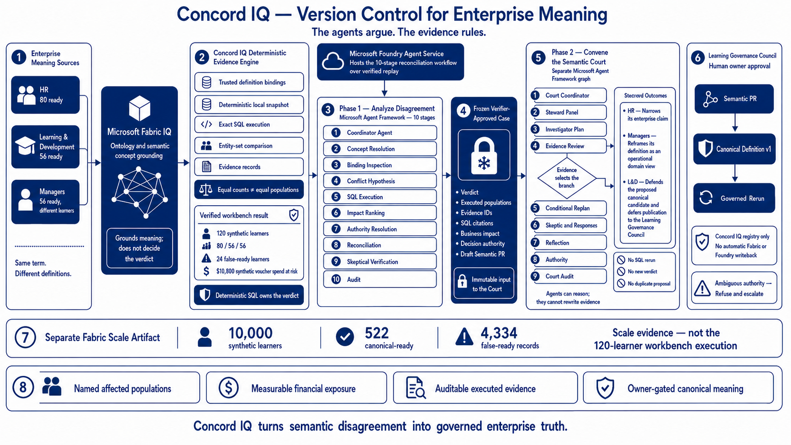

# Concord IQ

**Version control for the meaning behind enterprise metrics and decisions.**

Concord IQ proves when teams use the same term differently, executes each definition
over the same population, and proposes a governed canonical definition only when the
configured owner is allowed to approve it.

The challenge-facing default is the **Learning** system and its **Certification Ready**
scenario. The same engine also contains a preserved Business system. The UI and API are
pack-driven so additional governed semantic systems can be registered without changing
the deterministic verdict contract.

[](#why-concord-iq)
[](#default-learning-demo)
[](LICENSE)

## Why Concord IQ

Enterprises built a single source of truth for data, but not for meaning. Concord IQ:

- runs ten typed specialist stages through Microsoft Agent Framework;
- grounds Certification Ready through Fabric IQ ontology matching or a verified
  sanitized replay, while Concord IQ supplies the trusted executable bindings;
- executes competing definitions as deterministic SQL over fixed-seed synthetic data;
- compares result sets, not wording, to decide conflict versus consistency;
- resolves authority from configured governance rules;
- refuses unsupported or ambiguously owned reconciliations;
- creates an evidence-backed Semantic PR gated to the configured human owner;
- can convene a second Microsoft Agent Framework workflow, the Semantic Court, over
  the exact frozen run without re-executing SQL or creating another proposal;
- captures the Court as a digest-sealed transcript that can be verified with no cloud.

An LLM can narrate a result, but it cannot change the verdict, authority decision,
refusal, evidence, or stored canonical definition.

## Current Verified State

Verified through **June 14, 2026**:

| Surface | Status | What actually happens |
|---|---|---|
| Fabric IQ Live | Verified | Live ontology grounding for Certification Ready; deterministic SQL computes counts and verdict |
| Fabric IQ Replay | Verified | Sanitized real Fabric capture replays locally with no cloud call |
| Foundry Agent Service | Verified live | Existing `concord-iq-2` agent, version 4, runs the strict Agent Framework workflow over the verified learning replay |
| Local Deterministic | Verified | Cloud-free learning or business pack over synthetic DuckDB data |
| Foundry IQ | Advisory only | Transport-tested authority grounding; no real-tenant capture claimed |
| Work IQ | Implemented, license-gated | Authentication path exists; no completed live retrieval is claimed |

Foundry Agent Service does **not** make a hidden Fabric call. Its hosted workflow uses
the verified Fabric replay. Select **Fabric IQ Live** in the UI when the demo must show a
fresh Fabric semantic grounding call.

## One-Command Demo

Prerequisites:

- Python 3.12+, [`uv`](https://docs.astral.sh/uv/), Node.js, `pnpm`, and GNU Make
- Docker Desktop with Docker Compose v2
- Azure CLI authenticated with `az login`
- stable Fabric and Foundry endpoints/IDs in the local, gitignored `.env`
- the Foundry learning agent deployed once, as described below

One-time local setup:

```bash
make setup
```

Start the presenter stack:

```bash
make dev
```

`make dev` automatically:

1. reads `.env`;
2. acquires fresh Fabric and Foundry bearer tokens in memory;
3. starts PostgreSQL and seeds deterministic learning data;
4. starts the FastAPI backend and React/Vite UI;
5. selects **Learning + Fabric IQ Live** by default;
6. exposes UI buttons for Fabric Live, Fabric Replay, Foundry Live, and Local.

Open [http://127.0.0.1:5173](http://127.0.0.1:5173).

Expected startup banner:

```text
Concord IQ demo mode
Backend:  http://127.0.0.1:8000
Frontend: http://127.0.0.1:5173
Provider: fabric_iq + foundry_hosted + replay
Cloud:    enabled
```

Stop only the processes recorded by the Concord launcher:

```bash
make stop
```

## UI Runtime Controls

The top runtime bar contains two independent selectors.

### System

- **Learning** is selected by default.
- **Business** is visible but disabled by default.
- Set `CONCORD_ENABLE_BUSINESS=true` in `.env` and restart to enable Business.

Business currently supports Local and Fabric Replay. The live Fabric ontology and hosted
Foundry deployment are intentionally learning-specific, so those buttons remain
unavailable for Business.

### Proof Runtime

| Button | Cloud call | Meaning |
|---|---:|---|
| Fabric IQ Live | Yes | Fresh Fabric semantic grounding; SQL still owns the verdict |
| Fabric IQ Replay | No | Verified sanitized Fabric capture |
| Foundry Agent Service Live | Yes | Live hosted strict workflow over verified replay |
| Local Deterministic | No | Synthetic fallback for development and tests |

Runtime selection is process-local and ephemeral. Switching does not create a proposal,
change governance state, or persist credentials.

## Default Learning Demo

### Certification Ready: proven conflict

| Owner | Executed definition | Ready learners |
|---|---|---:|
| HR | All required modules complete | 80 |
| Learning & Development | Modules complete and latest practice score at least 80% | 56 |
| Managers | Required labs complete and manager approval recorded | 56 |

The two 56-learner populations are different sets. Concord IQ proves the conflict,
identifies 24 false-ready learners, and reports $10,800 of synthetic exam-voucher spend
at risk. The Learning Governance Council is the configured owner, so Concord drafts a
Semantic PR for human approval.

This visible workbench execution contains **120 synthetic learners**. A separate
Fabric-bound scale package contains **10,000 synthetic learners**, **522
canonical-ready records**, and **4,334 false-ready records**. The UI labels that package
as a scale artifact; it is not the execution that produced 80/56/56, 24, or $10,800.

### Required Training Complete: wording decoy

Two differently worded definitions execute to the same 80 learners. The deterministic
verdict is `consistent`; no proposal or refusal is created.

### Exam Eligible: governed refusal

The definitions diverge, but authority is ambiguous. Concord IQ refuses automatic
reconciliation and promotes nothing.

## The Semantic Court

The workbench presents two explicit phases:

1. **Evidence workflow:** the original ten-stage Microsoft Agent Framework
   reconciliation executes definitions, verifies evidence, and produces the immutable
   verdict, authority decision, proposal, or refusal.
2. **Semantic Court:** clicking **Convene the Semantic Court** starts a separate
   Microsoft Agent Framework graph over that exact cached, verifier-approved run. It
   performs no SQL rerun, cloud recall, new verdict, or duplicate proposal.

The Court graph is fixed and auditable; the evidence selects its branches. Consistent
populations skip cross-examination. Conflicts enter skeptic, steward-response,
reflection, and authority stages. A targeted, maximum-one-retry replan fires when exact
identities expose an unresolved comparison, including equal counts with unequal IDs.

In the Certification Ready case, HR narrows its enterprise claim after the 24-person
false-ready finding, Managers preserve their result as an operational domain view, and
Learning & Development defends the proposed canonical candidate while deferring
publication to the Learning Governance Council. Ambiguous authority preserves refusal;
no steward wins.

The agents argue; the evidence rules. The verdict, authority decision, proposal, and
refusal stay exactly what the deterministic engine produced — the court only voices and
pressure-tests them. Each turn carries an agent name, typed disposition, exact evidence
citations, and narration provenance. `CourtAuditAgent` rejects any mismatch with the
original run. The debate can also be captured as a sanitized, digest-sealed transcript
and verified without cloud or a model (`make capture-deliberation`,
`make court-replay-check`).

### Challenge A agent mapping

| Challenge A agent | In Concord IQ |
|---|---|
| Learning Path Curator / Study Plan Generator | Out of scope by design — Concord governs the meaning of readiness, it does not generate study plans |
| Assessment Agent | The stewards and investigator evaluate readiness over grounded evidence and quantify the false-ready cohort |
| Manager Insights Agent | The court's core: team-level readiness, the divergent cohort, and exam-spend risk, surfaced without guessing |
| (added) Governance / authority | The authority agent and owner-gated Semantic PR — the part that makes a readiness number trustworthy |

## Environment

Copy `.env.example` to `.env` and keep access-token values empty. Tokens are acquired at
runtime and never written to the file.

Important flags:

```dotenv
CONCORD_SCENARIO_PACK=learning
CONCORD_ENABLE_BUSINESS=false
CONCORD_RUNTIME_SWITCHING=false
CONCORD_DEFAULT_RUNTIME=fabric_live

LEARNING_REPLAY_ARTIFACT_PATH=artifacts/replay/sanitized/certification-ready.latest.json
BUSINESS_REPLAY_ARTIFACT_PATH=artifacts/replay/sanitized/latest.json
```

`make dev` explicitly enables runtime switching and live cloud access for that child
process. The repository defaults remain fail-closed. Use this for an offline stack:

```bash
make dev-local
```

`make dev-local` forces `PROVIDER=local`, `ALLOW_CLOUD=false`, and
`MAX_CLOUD_CALLS=0`, and strips inherited cloud tokens.

## Foundry Learning Agent

Authenticate Azure Developer CLI once:

```bash
azd auth login
```

Build the Linux AMD64 image, update the existing `concord-iq-2` agent, and run the live
proof check:

```bash
make foundry-hosted-deploy
```

This command ends by requiring the hosted response to report:

```text
provider_mode=replay
workflow_mode=strict
term=Certification Ready
verdict=conflict
verification_status=passed
specialist_steps=10
```

To check the already deployed agent without redeploying:

```bash
make foundry-hosted-smoke
```

The smoke command reads the endpoint from `.env`, acquires a short-lived Foundry token
via Azure CLI, permits exactly one cloud call, and writes only a secret-free report.

## Other Run Modes

```bash
make dev-local       # Learning, local deterministic, no cloud
make dev-fabric      # Learning, direct live Fabric IQ
make dev-foundry     # Learning, direct Foundry Agent Service
make dev-fresh       # Reset only local synthetic state, then start local Learning
make replay-check    # Verify the configured sanitized replay
make cloud-proof     # Report configured cloud proofs honestly
make help            # Show all supported commands
```

Work IQ is separate and may remain tenant-license-gated:

```bash
make dev-work-iq
```

## Architecture



Fabric IQ supplies semantic concept grounding and provenance; Concord IQ's trusted
scenario supplies the executable bindings. The first Microsoft Agent Framework workflow
coordinates the ten-stage reconciliation over a typed casefile. Deterministic execution
compares population IDs and produces evidence. A separate Microsoft Agent Framework Court
may then deliberate over the frozen approved run. Authority rules and the skeptical
verifier gate any proposal. Authorized approval promotes a version only inside the
Concord IQ registry; it does not write back to Fabric IQ, Foundry IQ, or Work IQ.

Detailed architecture: [docs/architecture.md](docs/architecture.md).

## Submission Resources

- [Project submission narrative](docs/hackathon-submission.md)
- [Two-minute recording script](docs/demo-script.md)
- [Architecture and workflow diagrams](docs/architecture.md)
- [Microsoft IQ integration boundaries](docs/iq-integration.md)
- [Reproducible proof index](docs/proofs/README.md)
- [Submission checklist](SUBMISSION_CHECKLIST.md)
- [Public GitHub repository](https://github.com/karimbaidar/concordIQ)

## Verify

Run the complete project gates:

```bash
make test
make lint
make judge-proof
```

Useful focused proofs:

```bash
make eval
make replay-check
make court-replay-check
make foundry-hosted-smoke
```

`make judge-proof` includes the Semantic Court replay as a mandatory step; `make
capture-deliberation` records a fresh debate transcript.

## Safety Contract

- SQL result-set equality owns conflict versus consistency.
- Configured rules own authority.
- The skeptical verifier blocks incomplete evidence.
- Ambiguous authority causes refusal.
- Cloud providers fail closed without permission, budget, endpoint, and authentication.
- Local data is synthetic with seed `20260606` and reference date `2026-06-01`.
- Tokens are never logged, persisted in `.env`, or passed on a command line.
- Tests inject transports and do not call Microsoft services.

## License

Apache License 2.0. See [LICENSE](LICENSE).
