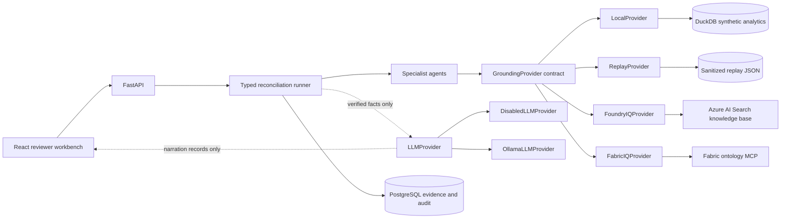
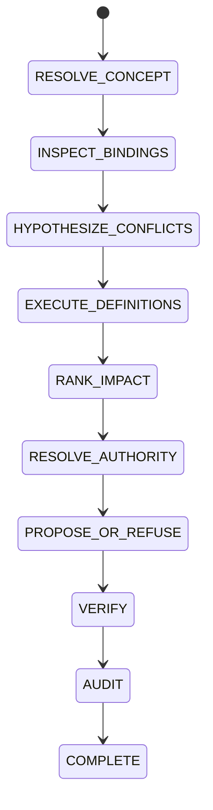

# Concord IQ architecture

Concord IQ is a semantic reconciliation agent with a deterministic truth path.
It separates semantic grounding, analytical execution, governance, and optional
language generation so a fluent explanation cannot change an evidence-backed
verdict.

## System view

## Reconciliation flow

Each specialist writes typed output to a casefile. The skeptical verifier blocks
unsupported proposals. The audit agent persists the result, evidence references,
exact SQL, decision, and complete state timeline.

## Provider model

All grounding modes implement the same contract:

- resolve a business term to a canonical concept
- return operational definition bindings
- evaluate a trusted binding for a fixed period
- return the relevant ontology subgraph
- return configured authority rules

`LocalProvider` is deterministic reviewer mode. `ReplayProvider` consumes a
reviewed, synthetic-only capture. The Foundry and Fabric adapters retrieve the
same typed snapshot from Microsoft IQ surfaces and cache it for the remainder of
the case. They never fall back to local data silently.

`LLMProvider` is a separate axis. Disabled mode returns reviewed deterministic
text. Ollama posts schema-constrained requests to the local `/api/chat` endpoint.
Its result type contains text and provenance only, so it cannot return a verdict,
authority choice, evidence set, impact value, or approval decision. Connection or
validation failures fall back without interrupting reconciliation.

The adapter follows Ollama's official
[chat API](https://docs.ollama.com/api/chat) and
[structured output](https://docs.ollama.com/capabilities/structured-outputs)
contracts with streaming disabled and temperature zero.

## Data flow and trust

1. The user selects one of three synthetic scenarios.
2. The provider returns only the resolved scenario context.
3. Trusted definition bindings produce entity sets and metric totals.
4. Agents compare behavior, rank impact, and consult authority rules.
5. The verifier checks evidence completeness and decision constraints.
6. Optional narration receives a compact copy of those verified facts.
7. PostgreSQL stores the auditable case, including narration provenance.

The context packet excludes execution results and decisions until those stages
have run. This keeps each specialist scoped to the information it needs.

## Deployment posture

Cloud calls are disabled by default. Opening the UI, listing providers, running
tests, and using `LocalProvider` or `ReplayProvider` make no Microsoft request.
Cloud adapters require an explicit opt-in and a positive hard call budget.

See [IQ integration](iq-integration.md), [cost controls](cost-controls.md), and
[threat model](threat-model.md).
