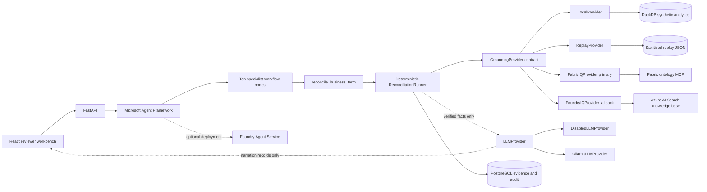
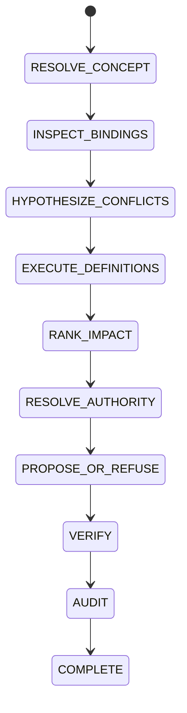

# Concord IQ architecture

Concord IQ uses Microsoft Agent Framework as its orchestration layer and the
existing deterministic reconciliation engine as its domain tool layer. Semantic
grounding, analytical execution, governance, and optional language generation
remain separated so fluent explanation cannot change an evidence-backed verdict.

## System view



## Reconciliation flow

The Agent Framework graph is:

```text
CoordinatorAgent -> ConceptResolverAgent -> BindingInspectorAgent
-> ConflictHypothesisAgent -> DataExecutionAgent -> ImpactRankerAgent
-> AuthorityResolverAgent -> ReconciliationAgent
-> SkepticalVerifierAgent -> AuditAgent
```

The workflow runs in two modes. **Fast** mode (default) calls the deterministic
domain tool once and exposes the resulting trace; each later node validates its
corresponding typed output before forwarding the casefile. **Strict** mode
(`CONCORD_WORKFLOW_MODE=strict`) makes the Agent Framework own the progression — each
specialist node executes exactly one stage and writes its typed output into the
casefile, so no single call performs the whole reasoning. Both modes share the same
deterministic truth path and reach the same verdict.

The domain tool retains the tested state machine:



The skeptical verifier blocks unsupported proposals: it checks required evidence
IDs, stored SQL, divergent-vs-equal result sets, authority status, and
proposal/refusal validity. On failure the case is marked `blocked` or
`needs_review`; one recovery retry is allowed for a recoverable missing-step
output, and the verifier never invents evidence to pass. The audit agent persists
the result, evidence references, exact SQL, decision, and complete state timeline.

Every run also emits a typed **agent trace** (step number, agent, input/output
summary, evidence IDs, provider mode, verifier status, duration), persisted and
served at `GET /runs/{run_id}/agent-trace` and shown in the reviewer workbench so
the multi-agent pattern is explicit.

## Hosting and layering

```text
Foundry Agent Service   hosts/deploys the Agent Framework workflow
Microsoft Agent Framework   orchestrates specialist agents and workflow states
Concord IQ deterministic tools   execute SQL, evidence, authority, verifier, audit
Fabric IQ   primary semantic ontology grounding
Foundry IQ   fallback knowledge grounding
ReplayProvider   sanitized Microsoft IQ replay
LocalProvider   deterministic reviewer mode
```

The Foundry Agent Service hosting protocol is validated cloud-free with
`make foundry-agent-dry-run` and `make foundry-agent-smoke` (LocalProvider or a
verified ReplayProvider artifact, no Fabric credentials). A real tenant deployment
and a real Fabric IQ capture remain deliberately deferred. See
[Foundry Agent Service](foundry-agent-service.md).

## Provider model

All grounding modes implement the same contract:

- resolve a business term to a canonical concept
- return operational definition bindings
- evaluate a trusted binding for a fixed period
- return the relevant ontology subgraph
- return configured authority rules

`LocalProvider` is deterministic reviewer mode, not fake Microsoft IQ.
`ReplayProvider` consumes a reviewed, synthetic-only capture. For automatic cloud
selection, Fabric IQ is preferred because ontology and governed business
vocabulary are central to Concord IQ. Foundry IQ is the fallback knowledge
provider. Neither cloud path falls back to local data silently.

`LLMProvider` is a separate axis. Disabled mode returns reviewed deterministic
text. Ollama posts schema-constrained requests to the local `/api/chat` endpoint.
Its result type contains text and provenance only, so it cannot return a verdict,
authority choice, evidence set, impact value, or approval decision. Connection or
validation failures fall back without interrupting reconciliation.

The adapter follows Ollama's official
[chat API](https://docs.ollama.com/api/chat) and
[structured output](https://docs.ollama.com/capabilities/structured-outputs)
contracts with streaming disabled and temperature zero.

## Engagement surfaces

Three read-only, deterministic surfaces sit on top of the reconciliation engine
and never weaken the truth path:

- **`nl_query` / `POST /ask`** resolves a natural-language question to a governed
  concept and its competing definitions, then runs the full reconciliation. On
  Fabric/Foundry the resolution is served by NL2Ontology/retrieve; Local and
  Replay answer the same typed contract deterministically.
- **`scan_portfolio` / `GET /scan` / `make scan`** sweeps every concept through
  the deterministic agents (no persistence, no cloud), ranks conflicts by ARR
  impact, and derives a single 0–100 **Concord Score** plus a per-business-unit
  leaderboard (`GET /score`).
- **The Semantic-PR approval gate** (`POST /proposals/{id}/approve|reject`) merges
  a canonical definition only when the caller equals the proposal's configured
  authority owner. Approval atomically versions and promotes exactly one canonical
  `MetricDefinition`, links it to the proposal, supersedes a prior canonical, and
  appends both decision and promotion events to the audit trail. The next local
  reconciliation executes the approved source binding as the unqualified governed
  meaning while retaining prior definitions as named domain views. This is a write
  to Concord's own registry, not Fabric or Foundry. The owner check is a
  configuration lookup, never an LLM judgement.

## Data flow and trust

1. The user asks a natural-language question, runs the autonomous scan, or selects
   one of the synthetic concepts.
2. The provider returns only the resolved scenario context.
3. Trusted definition bindings produce entity sets and metric totals.
4. Agents compare behavior, rank impact, and consult authority rules.
5. The verifier checks evidence completeness and decision constraints.
6. Optional narration receives a compact copy of those verified facts.
7. PostgreSQL stores the auditable case, including narration provenance.

The context packet excludes execution results and decisions until those stages
have run. This keeps each specialist scoped to the information it needs.

## Deployment posture

The workflow is deployed through the Foundry Agent Service entrypoint in
`concord.ms_agent.foundry_hosted_entrypoint`. The deployed reviewer runtime uses
ReplayProvider with cloud grounding disabled. Separately, the main FastAPI app can
set `PROVIDER=foundry_hosted` to call that deployed Responses endpoint; this caller
requires explicit cloud permission, a positive budget, endpoint, and token.

Cloud calls are disabled by default. Opening the UI, listing providers, running
tests, and using `LocalProvider` or `ReplayProvider` make no Microsoft request.
Cloud adapters require an explicit opt-in and a positive hard call budget.

See [IQ integration](iq-integration.md), [cost controls](cost-controls.md), and
[threat model](threat-model.md).
