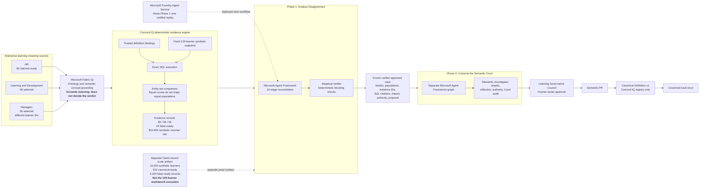
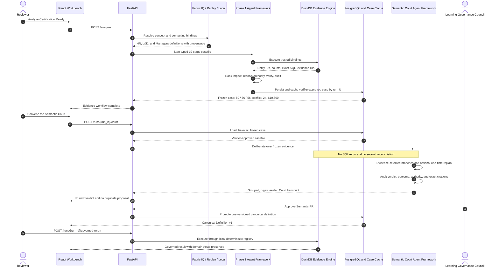
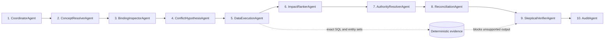
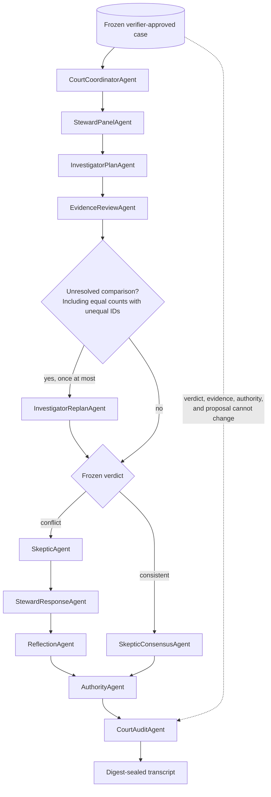

# Concord IQ architecture

Concord IQ is a learning and certification governance system built around one
rule: agents may investigate and explain, but deterministic evidence owns the
verdict. The primary demonstration reconciles three operational definitions of
**Certification Ready** over a fixed, synthetic 120-learner workbench case.

Microsoft Fabric IQ grounds the business concept and its relationships. Microsoft
Agent Framework coordinates two distinct reasoning workflows. Exact SQL, entity-set
comparison, configured authority, skeptical verification, and human approval remain
outside model control.

## Learning system view

The `$10,800` value belongs only to the 24-learner difference in the 120-learner
workbench case. It is not derived from, or combined with, the separate 10,000-row
Fabric scale artifact.

## Exact case lifecycle

Completed verifier-approved cases are held in a bounded runtime cache keyed by
`run_id`. An unknown or expired run returns a friendly `404`; an incomplete or
unverified case returns `409`. A verified Foundry-hosted case is imported
idempotently into the local Concord IQ registry so the configured owner can approve
it. The governed rerun is deliberately local and performs no Fabric or Foundry
writeback.

## Phase 1: evidence workflow

The first Microsoft Agent Framework graph produces the governed case:

The conflict hypothesis stage records a claim, a skeptical challenge, and the
eventual data ruling. SQL result-set equality settles the ruling. The verifier
checks evidence completeness, result-set behavior, authority consistency, proposal
validity, and impact derivation before the case can be shown as complete.

Foundry Agent Service hosts this ten-stage strict workflow over the verified
Certification Ready replay. It does not host the second Court graph.

## Phase 2: Semantic Court

The Court is a separate Agent Framework graph over the frozen case:

For the Certification Ready conflict:

- HR narrows its enterprise claim after the 24-person false-ready finding.
- Managers reframe their result as an operational domain view.
- Learning and Development defends the proposed canonical candidate but defers
  publication to the Learning Governance Council.
- Ambiguous authority produces no winner; the authority agent preserves the
  engine's refusal.

`CourtAuditAgent` recomputes a digest over engine-owned facts and proves that the
Court outcome, verdict, authority, proposal state, and exact evidence citations
still match the original case. Model narration is optional. Deterministic fallback
narration traverses the same Agent Framework graph.

## Provider and provenance model

| Reviewer label | Meaning |
| --- | --- |
| Fabric IQ Live | Fabric ontology match with deterministic local snapshot execution |
| Fabric Replay | Sanitized, verified Fabric capture replay with no cloud call |
| Foundry Agent Service Live | Hosted Phase 1 Agent Framework workflow over verified replay |
| Local | Fully local grounding and deterministic execution |

`FabricIQProvider`, `ReplayProvider`, and `LocalProvider` implement the same typed
grounding contract. Fabric IQ supplies semantic grounding; the displayed learner
populations are computed by Concord IQ's deterministic evidence path. Foundry IQ
authority grounding is advisory only and cannot replace the configured authority
rule. Work IQ is implemented behind a fail-closed adapter but remains license-gated
and is not claimed as a completed live retrieval.

Optional model narration receives verified facts only. Its result type contains
text and provenance, not verdicts, authority choices, evidence sets, impact values,
or approval decisions.

## Trust and storage boundaries

- **DuckDB** holds fixed-seed synthetic learning data and executes trusted SQL.
- **PostgreSQL** stores cases, exact evidence, proposals, canonical versions, agent
  traces, and audit events.
- **RuntimeManager** caches a bounded set of completed cases for exact-run Court
  deliberation.
- **The Concord IQ registry** is the only system changed by approval.
- **Fabric IQ and Foundry Agent Service** receive no automatic writeback.
- **Cloud is off by default** and every cloud adapter requires explicit permission,
  authentication, an endpoint, and a positive call budget.

See [IQ integration](iq-integration.md), [Foundry Agent Service](foundry-agent-service.md),
[cloud runtime](cloud-runtime.md), and [threat model](threat-model.md).
