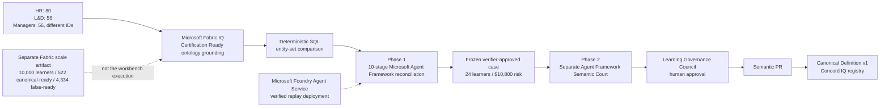

# Hackathon submission draft

## Project

**Concord IQ - Version Control for Enterprise Meaning**

**Tagline:** The agents argue. The evidence rules.

Enterprises have built a single source of truth for data, but not for meaning.
Concord IQ detects when teams use the same business term with different executable
definitions, proves the affected population with deterministic SQL, quantifies the
impact, and routes a versioned canonical definition to the real human owner.

The primary demonstration is an enterprise learning and certification case.
HR says 80 learners are **Certification Ready**. Learning and Development says 56.
Managers also say 56, but they select different learners. Nobody is lying: the
organization never governed what "ready" means.

Concord IQ proves the disagreement over a fixed 120-learner synthetic snapshot. It
identifies 24 false-ready learners and `$10,800` in synthetic exam-voucher spending
at risk. That turns an invisible semantic disagreement into a named cohort,
measurable exposure, exact SQL evidence, and an accountable decision.

## Architecture at a glance

## Track alignment

### Reasoning Agents

Concord IQ implements two genuine Microsoft Agent Framework workflows with typed
state and role-specialized agents.

**Phase 1 - Analyze Disagreement** is a ten-stage reconciliation workflow:

1. Coordinator
2. Concept resolution
3. Binding inspection
4. Conflict hypothesis and skeptical challenge
5. Deterministic SQL execution
6. Impact ranking
7. Authority resolution
8. Reconciliation proposal or refusal
9. Skeptical verification
10. Audit

The conflict hypothesis agent can argue that wording differences imply different
populations; the skeptic challenges that claim; executed entity sets settle it.
Equal counts are not treated as equal populations. Every completed run exposes a
typed trace, evidence IDs, SQL citations, verifier status, and provider provenance.

This strict ten-stage workflow is deployed and verified on **Microsoft Foundry Agent
Service** over the sanitized Certification Ready Fabric replay.

**Phase 2 - Convene the Semantic Court** is a separate Agent Framework graph over
the exact frozen, verifier-approved case. The Court does not rerun SQL, call Foundry
again, create a second proposal, or change the verdict. Evidence selects the
conditional branches, including a maximum-one-retry investigator replan when equal
counts hide unequal learner identities.

HR narrows its enterprise claim. Managers reframe their definition as an
operational domain view. Learning and Development defends the proposed canonical
candidate but defers publication to the Learning Governance Council. A final Court
audit proves that the outcome, verdict, authority, and every citation still match
the original case.

### Best Use of IQ Tools

Microsoft Fabric IQ is used for what makes Concord IQ distinctive: semantic
business understanding.

- Fabric IQ grounds **Certification Ready** as an ontology-backed business concept
  spanning learners, certifications, modules, practice scores, labs, approvals,
  organizational owners, and readiness definitions.
- The live Fabric path records the real ontology match and clearly labels that
  Concord IQ's deterministic local snapshot executes the displayed SQL.
- A reviewed, sanitized Fabric capture reproduces the same semantic grounding with
  no cloud call.
- Foundry Agent Service hosts the ten-stage reconciliation over that verified replay.
- Foundry IQ authority grounding is advisory and cited; deterministic governance
  rules remain authoritative.
- Work IQ is implemented behind a guarded adapter, but the tenant retrieval remains
  license-gated and is not claimed as verified live.

A separate Fabric-bound package demonstrates scale with 10,000 synthetic learners,
522 canonical-ready records, and 4,334 false-ready records. It is visibly and
verbally separated from the 120-learner workbench execution. The `$10,800` impact
belongs only to the 24-learner workbench difference.

### Creativity and originality

Most certification agents help learners study, schedule practice, or predict exam
performance. Concord IQ governs the decision those systems depend on: what the
enterprise is allowed to mean by "ready."

The product makes semantic meaning itself versionable:

- competing definitions behave like branches
- executed evidence behaves like tests
- the Semantic Court exposes structured disagreement
- the skeptical verifier acts as a blocking quality gate
- the Semantic PR proposes the merge
- only the configured owner can promote the canonical version

The same engine generalizes to revenue, churn, risk, eligibility, compliance, and
other terms whose meaning differs across organizational boundaries. The legacy
business scenario pack remains a deterministic generalization and regression suite,
not the primary submission story.

### User experience and presentation

The reviewer workbench presents the experience as two explicit phases:

1. **Evidence workflow complete: 10 Agent Framework stages.**
2. **Convene a separate Agent Framework Court over this frozen run.**

The UI includes the Certification Ready meaning fork, exact counts and learner IDs,
business impact, SQL evidence, agent trace, grouped Court rounds, dispositions,
citations, workflow provenance, authority, Semantic PR, owner approval, and governed
rerun. Friendly errors replace raw API payloads, and each runtime is honestly
labeled as Fabric Live, verified Fabric Replay, Foundry Agent Service Live, or Local.

## Demonstrated behavior

- **Certification Ready conflict:** `80 / 56 / 56` over 120 synthetic learners.
- **Identity-level proof:** L&D and Managers both return 56 but select different
  learner populations.
- **Proven impact:** 24 false-ready learners and `$10,800` of synthetic voucher
  spending at risk.
- **Human governance:** the Learning Governance Council is the configured owner.
- **Owner-only promotion:** approval creates one versioned canonical definition in
  the Concord IQ registry.
- **Governed rerun:** executes locally through that registry while preserving the
  original domain views and audit history.
- **Safe refusal:** missing or ambiguous authority prevents automatic publication.
- **Scale evidence:** a separate 10,000-row Fabric-bound artifact reports 522
  canonical-ready and 4,334 false-ready records.
- **Generality:** the retained business pack verifies conflict, decoy, subtle-drift,
  refusal, and non-owner attack cases.

## Reliability and safety

- deterministic SQL result-set equality owns the verdict
- configured governance rules own authority
- agents and optional models cannot mutate verdicts, evidence, impact, or authority
- a skeptical verifier blocks unsupported or incomplete cases
- Court citations must exactly match the frozen case evidence
- ambiguous authority produces refusal rather than an invented winner
- only the configured human owner can promote a canonical definition
- approval writes only to the Concord IQ registry
- fixed-seed synthetic data is used throughout
- cloud calls are disabled by default, budgeted, and fail closed
- raw captures remain ignored; sanitized replay artifacts are typed and reviewed
- deterministic evaluation, trace, replay, and audit artifacts are reproducible

## Submission keywords

Microsoft Foundry, Microsoft Agent Framework, Microsoft Foundry Agent Service,
Microsoft Fabric IQ, Reasoning Agents, Enterprise Learning, Certification
Readiness, Multi-Agent System, Semantic Governance, Deterministic AI, Human in the
Loop, Responsible AI, Workforce Intelligence, Executed SQL, Auditability, Semantic
Court, Semantic PR, Reliability, Safety
