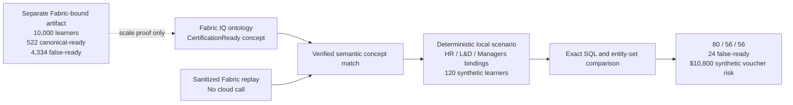

# Microsoft IQ integration

Concord IQ keeps provider identity visible because reproducibility and real IQ
integration are different claims.

## Provider modes

| Mode | Purpose | Network behavior |
| --- | --- | --- |
| `LocalProvider` | Deterministic development and reviewer mode | None |
| `ReplayProvider` | Rehearsal from a reviewed real-IQ capture | None |
| `FabricIQProvider` | Primary semantic grounding through ontology MCP | Guarded HTTPS/MCP |
| `FoundryIQProvider` | Fallback Azure AI Search knowledge-base retrieval | Guarded HTTPS |
| `WorkIQProvider` | Work IQ via M365 Copilot Retrieval (artifact-sourced definitions) | Guarded HTTPS |

When the Agent Framework tool receives `provider=auto`, it selects configured
Fabric IQ first. Foundry IQ is used only when Fabric IQ is unavailable. Explicit
provider names never fall back silently, and local mode remains the default.

## Challenge-facing learning proof



The live Learning path proves that Fabric IQ matched the governed
`CertificationReady` ontology concept. The displayed populations are then executed
against Concord IQ's deterministic local synthetic snapshot. This boundary is
reported as `fabric_semantic_proof_with_deterministic_snapshot`; it is not described
as Fabric computing the `80 / 56 / 56` counts.

The reviewed capture is
`artifacts/replay/sanitized/certification-ready.latest.json`. The separate scale
summary is `fabric_seed/learning_cli/ciq_certification_ready_summary.json`. The
`$10,800` workbench impact is never combined with the 4,334-record scale result.

The Foundry adapter calls the Azure AI Search knowledge-base `retrieve` action.
The default API version is `2026-04-01`, which uses semantic intents and returns
extractive grounding data. A configured knowledge source must contain Concord
IQ's synthetic scenario snapshot documents.

The Fabric adapter initializes the ontology MCP endpoint, lists tools, selects
`search_ontology` or `query_ontology`, and validates the returned snapshot.
The Certification Ready semantic match has been verified against a real tenant and
preserved as a sanitized replay. Fabric tool schemas can still evolve, so a fresh
tenant smoke is required before claiming a later deployment remains verified.

The Work IQ adapter calls the Microsoft 365 Copilot Retrieval API and reads its
`retrievalHits`, and is selected explicitly with `PROVIDER=work_iq` (it is not part of
the Fabric→Foundry auto-fallback chain). Two honest modes mirror Fabric IQ: a **full
snapshot** when a retrieved artifact carries the complete scenario JSON, or an
**artifact proof** when two or more distinct M365 / Power BI artifacts define the same
metric — Work IQ is then recorded as the real org-artifact proof and the deterministic
LocalProvider snapshot supplies the SQL/evidence
(`work_iq_artifact_proof_with_deterministic_snapshot`). Connectivity-only responses
(fewer than two defining artifacts) are rejected. Like Foundry IQ, the adapter is
guarded and injected-transport tested but **not** marked verified until a real
sanitized tenant capture exists.

## Advisory authority grounding (Foundry IQ, load-bearing)

During authority resolution, a configured provider may contribute an advisory, cited
governance clue via `retrieve_authority_grounding`. The Foundry IQ adapter supplies this
from its retrieved snapshot, making Foundry IQ retrieval load-bearing in a real live
step — yet the deterministic authority rule still decides the owner and status. The clue
is recorded as `advisory_grounding` on the authority assessment with `advisory_only=true`
and an `agrees_with_rule` flag; a clue that disagrees is surfaced but can never change the
decision. `LocalProvider` and `ReplayProvider` supply the same shape, labelled
"Deterministic local registry" / "sanitized capture replay", so reviewers see the step
without a tenant. Injected-transport tests cover it; no cloud call is made in CI.

## Verified Fabric API surfaces (confirmed 2026-06)

The bootstrap and adapter REST/MCP surfaces were checked against current
Microsoft Learn (Ontology REST API pages updated 2026-05/06). They are verified,
not assumed:

| Surface | Endpoint | Status |
| --- | --- | --- |
| Create workspace | `POST /v1/workspaces` | Verified (GA) |
| Assign capacity | `POST /v1/workspaces/{id}/assignToCapacity` | Verified (GA) |
| Create lakehouse | `POST /v1/workspaces/{id}/lakehouses` | Verified (GA) |
| List items by type | `GET /v1/workspaces/{id}/items?type=Ontology` | Verified (`Ontology` is in the `ItemType` enum) |
| Create ontology | `POST /v1/workspaces/{id}/ontologies` (201 / 202 LRO) | Verified (preview) |
| Update definition | `POST /v1/workspaces/{id}/ontologies/{id}/updateDefinition?updateMetadata=true` | Verified (preview) |
| Definition payload | `{definition:{parts:[{path,payload,payloadType:"InlineBase64"}]}}` over `definition.json`, `EntityTypes/{id}/definition.json`, `.platform` | Verified shape |
| Ontology MCP endpoint | `/v1/mcp/dataPlane/workspaces/{ws}/items/{ont}/ontologyEndpoint` | Verified shape |

The only surface still treated as best-effort is the base64 `.platform`
definition part (its exact schema is not published). If `updateDefinition` is
rejected, the bootstrap preserves the created resources and prints the manual
Fabric UI import steps; nothing is lost.

## Prerequisites before cloud bootstrap

1. Enable the **"Enable Ontology item (preview)"** tenant setting in the Fabric
   admin portal. Creating an ontology fails without it.
2. The caller needs a **contributor** workspace role and the
   **`Item.ReadWrite.All`** delegated scope (user or service principal).
   `az account get-access-token --resource https://api.fabric.microsoft.com`
   supplies a suitable token for an authorized user.
3. The workspace must be on a **supported capacity. F2 is the minimum SKU** for
   the Ontology preview, so a planned F2 capacity is sufficient.

Official references:

- [Microsoft Agent Framework workflows](https://learn.microsoft.com/en-us/agent-framework/workflows/)
- [Foundry hosted agents](https://learn.microsoft.com/en-us/agent-framework/hosting/foundry-hosted-agent)
- [Azure AI Search knowledge-base retrieval](https://learn.microsoft.com/en-us/azure/search/agentic-retrieval-how-to-retrieve)
- [Foundry IQ and agentic retrieval](https://learn.microsoft.com/en-us/azure/search/agentic-retrieval-overview)
- [Fabric IQ overview](https://learn.microsoft.com/en-us/fabric/iq/overview)
- [Fabric ontology MCP server](https://learn.microsoft.com/en-us/fabric/iq/ontology/how-to-use-ontology-mcp-server)
- [Create Ontology (REST)](https://learn.microsoft.com/en-us/rest/api/fabric/ontology/items/create-ontology)
- [Update Ontology Definition (REST)](https://learn.microsoft.com/en-us/rest/api/fabric/ontology/items/update-ontology-definition)
- [Ontology preview tenant settings](https://learn.microsoft.com/en-us/fabric/iq/ontology/overview-tenant-settings)
- [Ontology billing and capacity usage](https://learn.microsoft.com/en-us/fabric/iq/ontology/resources-capacity-usage)

## Configuration

Foundry IQ:

```text
PROVIDER=foundry_iq
ALLOW_CLOUD=true
MAX_CLOUD_CALLS=3
FOUNDRY_IQ_ENDPOINT=https://<search-service>.search.windows.net
FOUNDRY_IQ_KNOWLEDGE_BASE=<knowledge-base>
FOUNDRY_IQ_ACCESS_TOKEN=<short-lived-token>
```

Fabric IQ:

```text
PROVIDER=fabric_iq
ALLOW_CLOUD=true
MAX_CLOUD_CALLS=6
FABRIC_IQ_MCP_ENDPOINT=https://api.fabric.microsoft.com/v1/mcp/dataPlane/...
FABRIC_IQ_ACCESS_TOKEN=<short-lived-token>
```

Secrets are represented as Pydantic secret values and are never included in
provider status output, replay metadata, or logs.

## Challenge-facing learning artifacts

The Learning package contains:

- a 120-learner fixed-seed workbench scenario used for the `80 / 56 / 56`
  reconciliation
- a verified, sanitized Fabric IQ semantic capture for `Certification Ready`
- a separate 10,000-row Fabric-bound package under `fabric_seed/learning_cli/`
  and `fabric_seed/learning_delta/`
- a scale summary reporting 522 canonical-ready and 4,334 false-ready records

The 10,000-row package demonstrates the ontology and data shape at a larger scale.
It is not silently substituted into the reviewer workbench.

## Fabric bootstrap and capture

Concord IQ has one guarded workflow from deterministic local data to a verified
cloud replay:

```bash
make fabric-bootstrap-dry-run
ALLOW_CLOUD=true make fabric-bootstrap
PROVIDER=fabric_iq ALLOW_CLOUD=true MAX_CLOUD_CALLS=6 make capture
make replay-check
```

`make fabric-bootstrap-dry-run` makes no Microsoft call. It regenerates the
legacy business/generalization seed from `LocalProvider`, the fixed synthetic
DuckDB seed, and the typed replay schema. That pack remains useful for regression
coverage. The challenge-facing Learning seed and verified replay are the artifacts
listed above.

`make fabric-bootstrap` refuses unless `ALLOW_CLOUD=true`. It reads `.env`, uses
`FABRIC_IQ_ACCESS_TOKEN` or the current Azure CLI login, and creates or reuses the
configured Fabric workspace, lakehouse, and ontology through public APIs where
available. The command never writes `.env` and never prints the token. It prints
resource IDs and the ontology MCP endpoint for the operator to paste into `.env`.

Ontology definition import is a preview surface. If the import fails, Concord IQ
preserves the created resources, records the failure in
`fabric_seed/bootstrap-report.md`, and prints the manual Fabric UI steps. Upload
or paste the generated seed artifacts into the tiny lakehouse/ontology setup,
publish the ontology, and then run capture.

Fabric capture uses a bounded MCP budget for initialization, notification, tool
discovery, and governed concept requests. `make replay-check` detects whether the
artifact is the Learning or business pack, then validates real-IQ provenance,
scenario completeness, ontology and definition evidence, executed evaluations,
authority rules, and secret hygiene. It runs the matching demo with
`PROVIDER=replay`, `ALLOW_CLOUD=false`, and `MAX_CLOUD_CALLS=0`.

## Scenario content: why entity types are not enough

A Fabric ontology entity *type* (for example `CertificationReady`) is only a
schema; it does not by itself contain the executed learner populations.
`FabricIQProvider` does not need types; it needs the full scenario **snapshot
JSON** (`scenario_id`, `term`, `concept`, `bindings`, `evaluations`, `subgraph`,
`authority_rules`) to be *retrievable* through the MCP. If the ontology exposes
only types, capture fails with "did not contain a Concord IQ scenario snapshot".

The bootstrap therefore also produces `fabric_seed/concord_iq_scenarios.json` —
one self-contained snapshot per capture scenario — and best-effort uploads it to
the lakehouse at `Files/concord_iq_scenarios.json` (OneLake). `FabricIQProvider`
asks Fabric IQ to retrieve that `concord_iq_scenarios` content and return the exact
JSON. If the automated upload cannot run (no OneLake storage token), upload
`fabric_seed/concord_iq_scenarios.json` to the lakehouse manually.

> **Limitation.** The public preview surfaces do not let the bootstrap create
> bound ontology *instances* directly, and in many tenants the ontology MCP can
> search entity types but will **not** return a Lakehouse `Files` JSON as a full
> snapshot. So retrieval is not guaranteed — confirm empirically (diagnose) before
> spending capture budget.

## Two honest Fabric capture modes

Fabric IQ is used as the semantic grounding layer. Capture has two modes:

1. **Full snapshot mode** — if the ontology MCP returns a complete Concord IQ
   scenario snapshot JSON, it is used exactly as captured.
2. **Semantic-proof mode** — in tenants where ontology MCP returns searchable
   ontology concepts but not full scenario JSON, Concord IQ records the real
   Fabric semantic proof. For the challenge-facing case, the MCP matched
   `Certification Ready` to `CertificationReady`; Concord IQ then attaches the
   deterministic synthetic scenario snapshot from `LocalProvider` for the
   SQL/evidence used in replay.

`FabricIQProvider` tries full-snapshot extraction first and only falls back to
semantic proof when a concept is genuinely matched; a connectivity-only response
with no matched concept is rejected. Semantic-proof artifacts are transparently
marked: `iq_proof_mode = "fabric_semantic_proof_with_deterministic_snapshot"`,
`snapshot_source = "LocalProvider synthetic snapshot"`, `data_classification =
"synthetic"`, plus the matched concepts and tools used. `make replay-check`
accepts a semantic-proof artifact only when Fabric matched every required concept.

**Claims discipline.** Do not claim "Fabric returned the full scenario snapshot"
unless full-snapshot mode actually succeeds. You may claim **"verified Fabric IQ
semantic grounding"** only after `make capture` and `make replay-check` pass with
real Fabric calls.

### Diagnose before you capture

Inspect the live MCP response first; it reports one of three states:

```bash
PROVIDER=fabric_iq ALLOW_CLOUD=true MAX_CLOUD_CALLS=6 make fabric-mcp-diagnose
```

It prints `Full snapshot JSON: FOUND`, `Semantic proof: FOUND`, or `No useful
Fabric content found`, along with the discovered tools, the matched concept, and
the response shape, and writes a sanitized copy to
`artifacts/replay/raw/diagnostic.json` (gitignored, no tokens). It never writes
the reviewed sanitized artifact. Run `make capture` only after diagnose reports a
valid full snapshot or a genuine semantic concept match.

## Foundry Agent Service

`concord.ms_agent.foundry_hosted_entrypoint` wraps the typed Microsoft Agent
Framework workflow in the Foundry Responses host. The hosting protocol is covered
cloud-free by `make foundry-agent-dry-run` and `make foundry-agent-smoke`; the
deployed replay/strict runtime has also passed remote invocation with all ten
specialist steps. `PROVIDER=foundry_hosted` routes the main app's `/analyze`,
`/ask`, and demo requests to that endpoint, validates the proof envelope, and
renders the returned typed case without contacting Fabric. See
[Foundry Agent Service](foundry-agent-service.md) and the
[integration README](../backend/concord/ms_agent/README.md).

## What counts as real integration

The acceptance gate is:

1. A configured adapter successfully calls a real Microsoft IQ endpoint.
2. The response contains only synthetic Concord IQ scenario data.
3. The raw response is retained locally in the ignored raw directory.
4. A reviewed, secret-free sanitized artifact is committed.
5. `ReplayProvider` runs the same typed contract from that artifact.

A **verified Fabric IQ semantic-proof capture has been made against a real tenant**
for Certification Ready. The reviewed, secret-free artifact is committed at
`artifacts/replay/sanitized/certification-ready.latest.json`. The ontology MCP
matched `Certification Ready` to `CertificationReady` through
`list_ontology_entity_types` and `search_ontology`; the deterministic
`LocalProvider` snapshot supplies the executed SQL and evidence.

`make replay-check` validates provenance, the matched concept, evidence, and secret
hygiene, then replays with cloud disabled so judges need no Fabric tenant, token,
or capacity. The older business artifact at
`artifacts/replay/sanitized/latest.json` remains regression/generalization proof.
Raw responses remain gitignored. The precise claim is **verified Fabric IQ semantic
grounding with deterministic local snapshot execution**, not that Fabric computed
the learner counts or returned a complete scenario snapshot.
