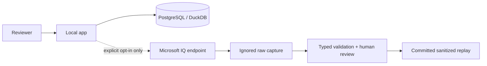

# Threat model

## Assets

- synthetic analytical data and ontology definitions
- semantic authority rules
- executed SQL and evidence
- Microsoft access tokens or API keys during manual capture
- raw and sanitized provider responses

## Trust boundaries

## Primary risks and controls

| Risk | Control |
| --- | --- |
| Accidental paid cloud use | `ALLOW_CLOUD=false`, `MAX_CLOUD_CALLS=0`, guard before every request |
| Secret exposure | `.env` ignored, Pydantic secret types, no credential logging |
| Tenant information in git | raw directory ignored; sanitized artifact redacts URLs, emails, GUIDs |
| Confidential business data | synthetic datasets and scenarios only |
| Fabric/Foundry response drift | strict typed snapshot validation and fail-closed parsing |
| Prompt or tool injection | adapters request registered snapshots; deterministic verifier owns decisions |
| Generated narrative changes truth | core decisions use SQL, rules, and typed agents without an LLM |
| Silent provider fallback | provider factory raises instead of substituting LocalProvider |
| Replay provenance confusion | verified capture flag required by default |
| Unsupported governance choice | reconciliation refuses when authority is missing or ambiguous |

## Public-repository review

Before staging a replay artifact:

1. Confirm the raw file remains ignored.
2. Inspect the sanitized JSON manually.
3. Search for tokens, keys, URLs, email addresses, tenant names, and GUIDs.
4. Confirm every scenario is marked synthetic.
5. Run the replay contract tests.
6. Review the diff before commit.

## Residual risks

Microsoft APIs, preview behavior, tool schemas, pricing, and tenant permissions can
change. The adapters require a current smoke test in the target tenant. Sanitizing
structured output reduces exposure but does not replace human review.
